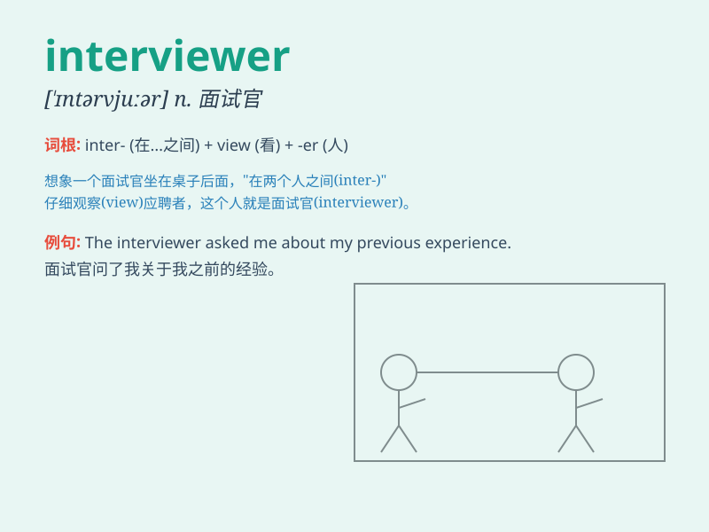

## interviewer

**英音:** _[ˈɪntəvjuːə(r)]_ **美音:** _[ˈɪntərvjuːər]_

**译义:** *n.会见者*

### 短语

+ **job interviewer:** _工作面试官_

+ **experienced interviewer:** _经验丰富的面试官_

+ **skilled interviewer:** _熟练的面试官_

+ **professional interviewer:** _专业的面试官_

+ **friendly interviewer:** _友好的面试官_

### 例句

#### 例句1

> **The interviewer asked me some tough questions.**

**中文翻译:** 面试官问了我一些棘手的问题。

**单词释义:** 面试官

#### 例句2

> **The interviewer seemed friendly and approachable.**

**中文翻译:** 这位面试官看起来友好且平易近人。

**单词释义:** 面试官

#### 例句3

> **I was nervous in front of the interviewer.**

**中文翻译:** 在面试官面前我很紧张。

**单词释义:** 面试官

### 背诵小故事

> One day, Tom went for a job interview. The person who asked him
questions was the interviewer. The interviewer was serious but friendly,
trying to understand if Tom was the right fit for the job.

**一天，汤姆去参加工作面试。问他问题的那个人就是面试官。这位面试官严肃但友好，试图了解汤姆是否适合这份工作。**

### 图义

