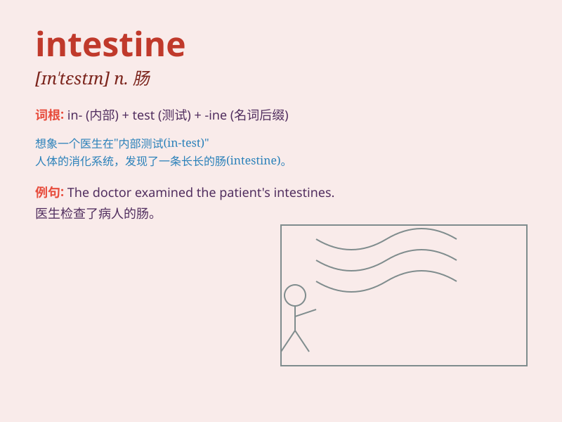

## intestine

**英音:** _[ɪn\'testɪn]_ **美音:** _[ɪn\'tɛstɪn]_

**译义:** *adj.内部的,国内的n.[解,动]肠*

### 短语

+ **small intestine:** _小肠_

+ **large intestine:** _大肠_

+ **intestinal flora:** _肠道菌群_

+ **intestinal obstruction:** _肠梗阻_

+ **intestinal tract:** _肠道；消化道_

### 例句

#### 例句1

> **The doctor examined the patient\'s intestine.**

**中文翻译:** 医生检查了病人的肠子。

**单词释义:** 肠子

#### 例句2

> **Some diseases affect the small intestine more than the large
intestine.**

**中文翻译:** 有些疾病对小肠的影响大于对大肠的影响。

**单词释义:** 肠子

#### 例句3

> **The food passes through the intestine for digestion and
absorption.**

**中文翻译:** 食物通过肠道进行消化和吸收。

**单词释义:** 肠道

### 背诵小故事

> Imagine a tiny detective inside your body. This detective is
exploring a long, winding tunnel - the intestine. It\'s like a secret
passage where food gets processed. The detective carefully checks every
part to make sure everything is working fine.

**想象一下在你身体里有一个小侦探。这个侦探正在探索一条又长又弯曲的隧道------肠子。它就像一个食物被处理的秘密通道。侦探仔细检查每一部分以确保一切正常。**

### 图义

