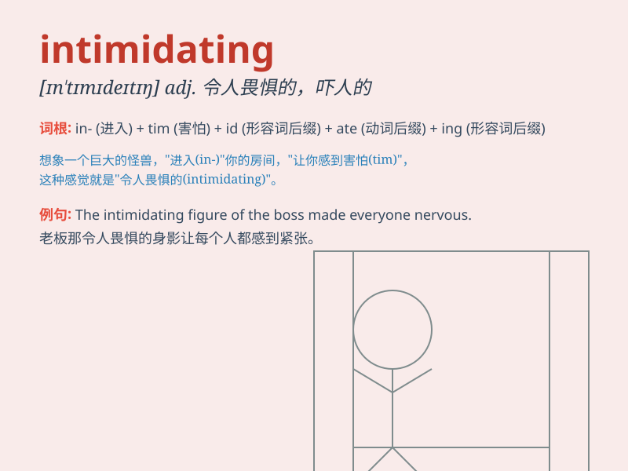

## intimidating

**英音:** _[ɪnˈtɪmɪdeɪtɪŋ]_ **美音:** _[ɪnˈtɪmɪdeɪtɪŋ]_

**译义:** *adj.令人胆怯的；令人紧张不安的；吓人的*

### 短语

+ **be intimidating:** _具有威胁性_

+ **intimidating look:** _吓人的表情_

+ **intimidating presence:** _令人胆怯的存在_

+ **intimidating behavior:** _恐吓的行为_

+ **intimidating atmosphere:** _令人害怕的氛围_

### 例句

#### 例句1

> **The bully\'s intimidating behavior made the younger kids afraid
to play in the park.**

**中文翻译:** 这个恶霸吓人的行为让年幼的孩子们不敢在公园里玩耍。

**单词释义:** 吓人的

#### 例句2

> **The towering skyscraper was intimidating to those who were afraid
of heights.**

**中文翻译:** 那座高耸的摩天大楼对于恐高的人来说是令人生畏的。

**单词释义:** 令人生畏的

#### 例句3

> **The teacher\'s intimidating tone silenced the noisy
classroom.**

**中文翻译:** 老师吓人的语气让喧闹的教室安静了下来。

**单词释义:** 吓人的

### 背诵小故事

> A little mouse was walking in the forest and met a big, fierce tiger.
The tiger\'s fierce look was intimidating. The mouse was so scared that
it ran away quickly.

**一只小老鼠在森林里走着，遇到了一只又大又凶的老虎。老虎凶猛的样子令人胆怯。老鼠害怕极了，很快就跑掉了。**

### 图义

