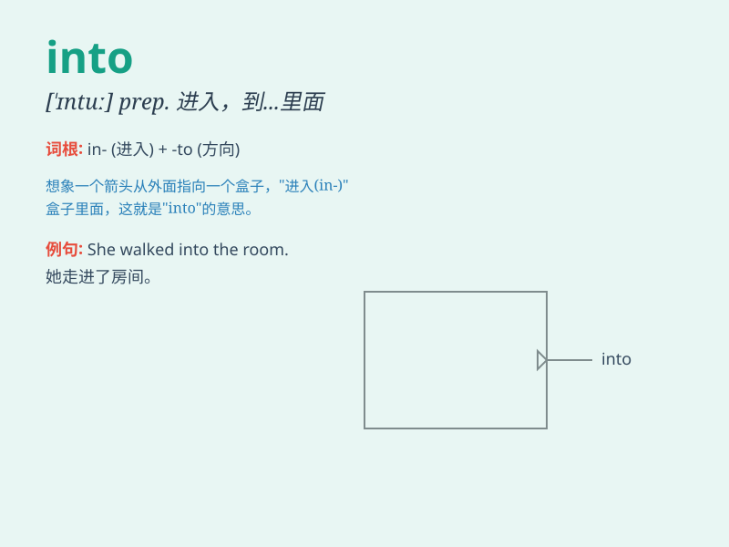

## into

**英音:** _[\'ɪntʊ; \'ɪntə]_ **美音:** _[ˈɪntu]_

**译义:** *
prep.到\...里,进入到\...之内,成为\...状况,深入\...之中*

### 短语

+ **break into:** _强行闯入；突然开始（笑、唱等）_

+ **look into:** _调查；审查；观察_

+ **run into:** _撞上；偶然遇见；陷入_

+ **translate into:** _翻译成；转化为_

+ **divide into:** _把......分成_

### 例句

#### 例句1

> **He walked into the room.**

**中文翻译:** 他走进了房间。

**单词释义:** 进入

#### 例句2

> **The car crashed into a tree.**

**中文翻译:** 汽车撞到了一棵树上。

**单词释义:** 撞上

#### 例句3

> **She divided the cake into pieces.**

**中文翻译:** 她把蛋糕分成了几块。

**单词释义:** 分成

### 背诵小故事

> A curious little mouse ventured INTO a big dark cave. It was very
brave as it went INTO the unknown. It wanted to explore what was INSIDE.

**一只好奇的小老鼠冒险进入一个又大又黑的洞穴。它非常勇敢地走进未知。它想探索里面有什么。**

### 图义

