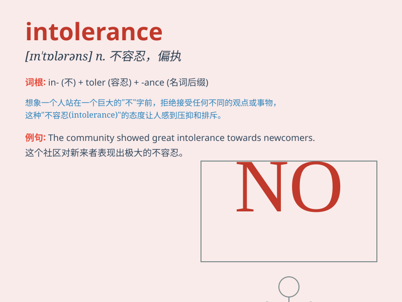

## intolerance

**英音:** _[ɪn\'tɒl(ə)r(ə)ns; ɪn\'tɒl(ə)rəns]_ **美音:**
_[ɪn\'tɑlərəns]_

**译义:**
*n.(尤指对别人的意见)不能忍耐,不容异说,偏狭,[医](对食物,药物等)不耐性*

### 短语

+ **food intolerance:** _食物不耐受_

+ **religious intolerance:** _宗教不容忍_

+ **intolerance to heat:** _不耐热_

+ **intolerance of ambiguity:** _对模糊性的不容忍_

+ **racial intolerance:** _种族不容忍_

### 例句

#### 例句1

> **His intolerance of others\' opinions led to many arguments.**

**中文翻译:** 他对他人意见的不容忍导致了许多争论。

**单词释义:** 不容忍；偏狭

#### 例句2

> **The intolerance towards different cultures is a major problem in
society.**

**中文翻译:** 对不同文化的不容忍是社会中的一个主要问题。

**单词释义:** 不容忍；不能忍受

#### 例句3

> **Religious intolerance has caused much conflict throughout
history.**

**中文翻译:** 宗教上的不容忍在历史上造成了许多冲突。

**单词释义:** 不容忍；偏执

### 背诵小故事

> Once upon a time, in a small town, there was a king named Tom. He
showed intolerance towards any new ideas. If someone proposed a
different way of doing things, he would get angry. This behavior made
people unhappy. \'Intolerance\' means lack of tolerance.

**从前，在一个小镇上，有一个叫汤姆的国王。他对任何新想法都表现出不容忍。如果有人提出不同的做事方式，他就会生气。这种行为让人们很不高兴。\'intolerance\'意思是不容忍。**

### 图义

