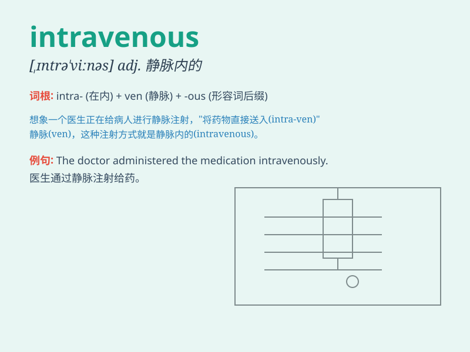

## intravenous

**英音:** _[,ɪntrə\'viːnəs]_ **美音:**
_[\'ɪntrə\'vinəs]_

**译义:** *adj.静脉内的*

### 短语

+ **intravenous injection:** _静脉注射_

+ **intravenous drip:** _静脉滴注_

+ **intravenous therapy:** _静脉治疗_

+ **intravenous catheter:** _静脉导管_

+ **intravenous line:** _静脉输液管_

### 例句

#### 例句1

> **The patient received intravenous antibiotics to fight the
infection.**

**中文翻译:** 这位病人接受了静脉注射抗生素来对抗感染。

**单词释义:** 通过静脉的；静脉内的

#### 例句2

> **Intravenous fluids were administered to rehydrate the
patient.**

**中文翻译:** 静脉输液被用来给病人补充水分。

**单词释义:** 通过静脉的；静脉内的

#### 例句3

> **The doctor prescribed intravenous pain medication for the severe
headache.**

**中文翻译:** 医生为严重的头痛开了静脉注射止痛药。

**单词释义:** 通过静脉的；静脉内的

### 背诵小故事

>
想象一个病人躺在医院病床上，医生准备给他进行治疗。医生说：'我们要通过静脉（intravenous）给你输送药物。'于是，一根细细的管子被插入了病人的静脉里，药物缓缓流入。

**想象通过静脉输送药物的场景来辅助记忆'intravenous（静脉内的；静脉注射的）'这个单词**

### 图义

