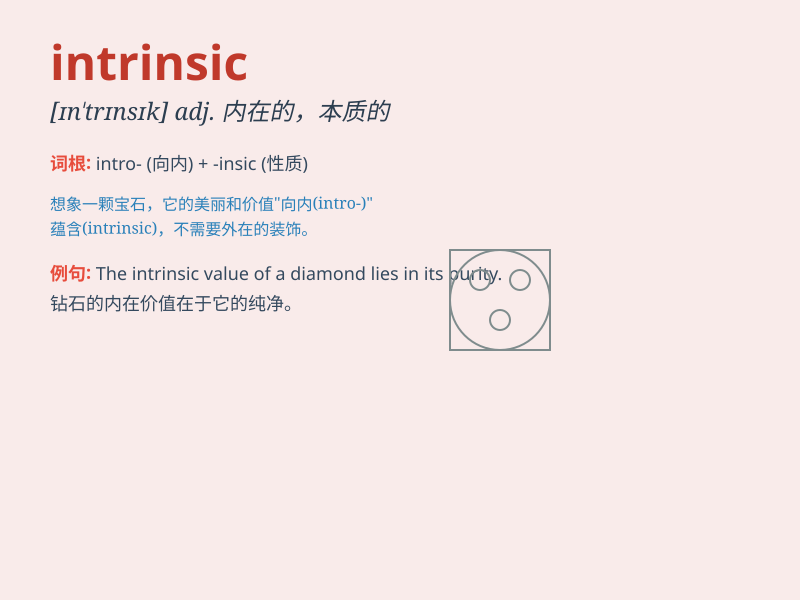

## intrinsic

**英音:** _[ɪnˈtrɪnsɪk]_ **美音:** _[ɪnˈtrɪnsɪk]_

**译义:** *adj.固有的，本质的，内在的*

### 短语

+ **intrinsic value:** _内在价值_

+ **intrinsic motivation:** _内在动机_

+ **intrinsic property:** _固有属性_

+ **intrinsic nature:** _内在本质_

+ **intrinsic quality:** _内在品质_

### 例句

#### 例句1

> **The intrinsic value of this antique is difficult to
determine.**

**中文翻译:** 这件古董的内在价值很难确定。

**单词释义:** 固有的；内在的；本身的

#### 例句2

> **Intrinsic motivation is more powerful than extrinsic
motivation.**

**中文翻译:** 内在动机比外在动机更强大。

**单词释义:** 内在的

#### 例句3

> **The beauty of nature has an intrinsic charm.**

**中文翻译:** 大自然的美有一种内在的魅力。

**单词释义:** 内在的；固有的

### 背诵小故事

> A brave adventurer was exploring a hidden cave. He found a gem that
shone with an intrinsic light, not because of any external source but
because of its own nature. Just like this gem, \'intrinsic\' means
belonging naturally to something.

**一位勇敢的探险家在探索一个隐藏的洞穴。他发现了一颗散发着内在光芒的宝石，不是因为任何外部光源，而是因为其自身的特性。就像这颗宝石一样，'intrinsic'意思是某物固有的、内在的。**

### 图义

