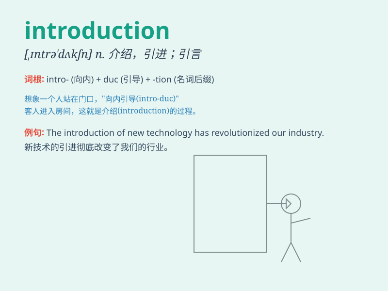

## introduction

**英音:** _[,ɪntrə\'dʌkʃ(ə)n]_ **美音:**
_[,ɪntrə\'dʌkʃən]_

**译义:** *n.介绍,传入,初步,导言,绪论,入门*

### 短语

+ **introduction to:** _对\...\...的介绍_

+ **course introduction:** _课程介绍_

+ **brief introduction:** _简要介绍_

+ **product introduction:** _产品介绍_

+ **letter of introduction:** _介绍信_

### 例句

#### 例句1

> **The introduction of new technology has greatly improved
productivity.**

**中文翻译:** 新技术的引入极大地提高了生产力。

**单词释义:** 引入；引进

#### 例句2

> **This book has a detailed introduction to ancient history.**

**中文翻译:** 这本书对古代历史有详细的介绍。

**单词释义:** 介绍

#### 例句3

> **The professor\'s introduction was very brief.**

**中文翻译:** 教授的开场白非常简短。

**单词释义:** 开场白；引言

### 背诵小故事

>
有一天，小明参加了一个神秘的聚会。门口的工作人员给了他一份特别的文件，这文件就像一把钥匙，打开了聚会的大门，这份文件就是对聚会的\'introduction\'（介绍），让小明迅速了解了聚会的情况。

**有一天，小明参加了一个神秘的聚会。门口的工作人员给了他一份特别的文件，这文件就像一把钥匙，打开了聚会的大门，这份文件就是对聚会的"介绍"，让小明迅速了解了聚会的情况。**

### 图义

