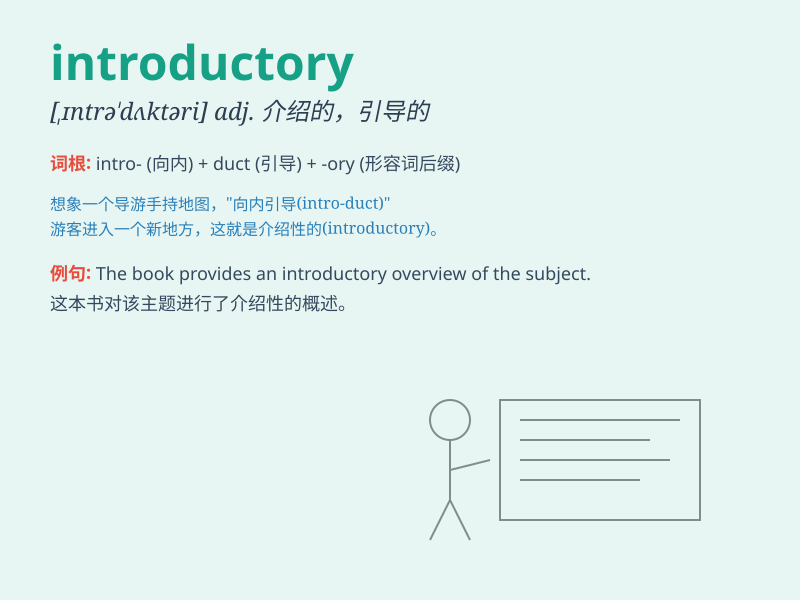

## introductory

**英音:** _[ɪntrə\'dʌkt(ə)rɪ]_ **美音:**
_[,ɪntrə\'dʌktəri]_

**译义:** *adj.介绍性的*

### 短语

+ **introductory course:** _入门课程；基础课程_

+ **introductory paragraph:** _引言段落；开头段落_

+ **introductory offer:** _优惠推介；试销优惠_

+ **introductory speech:** _开场白；介绍性演讲_

+ **introductory chapter:** _引言章节；导论章节_

### 例句

#### 例句1

> **The course begins with an introductory lecture on the history of
the subject.**

**中文翻译:** 这门课程以关于该学科历史的介绍性讲座开始。

**单词释义:** 介绍性的

#### 例句2

> **She wrote an introductory paragraph for the report.**

**中文翻译:** 她为报告写了一个引言段落。

**单词释义:** 引言的；引导的

#### 例句3

> **The introductory offer is available for a limited time only.**

**中文翻译:** 介绍性的优惠仅在有限的时间内可用。

**单词释义:** 介绍性的；初步的

### 背诵小故事

>
想象一个新学生来到学校，第一天参加的是introductory课程。老师友好地介绍各种规则和基础知识，让新同学能轻松入门。这就是introductory，引导入门的、介绍性的。

**想象新学生参加引导入门的课程来理解introductory意为引导入门的、介绍性的**

### 图义

