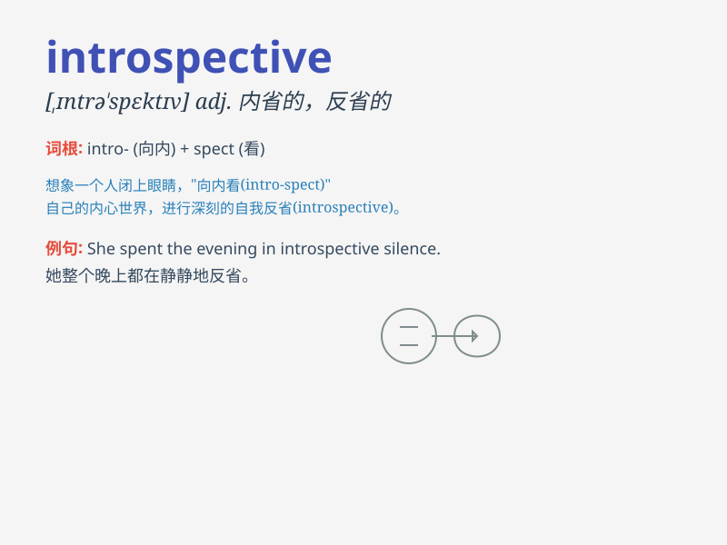

## introspective

**英音:** _[ɪntrə\'spektɪv]_ **美音:**
_[\'ɪntrə\'spɛktɪv]_

**译义:** *adj.(好)内省的,(好)自省的,(好)反省的*

### 短语

+ **introspective mood:** _内省的情绪_

+ **introspective journey:** _内省之旅_

+ **introspective thought:** _内省的想法_

+ **become introspective:** _变得内省_

+ **introspective analysis:** _内省式分析_

### 例句

#### 例句1

> **She became more introspective after the failure, constantly
reflecting on her actions.**

**中文翻译:** 在失败之后，她变得更加内省，不断反思自己的行为。

**单词释义:** 内省的；反省的

#### 例句2

> **His introspective nature made him a great philosopher.**

**中文翻译:** 他内省的天性使他成为了一位伟大的哲学家。

**单词释义:** 内省的；好自我反省的

#### 例句3

> **The artist\'s work is often introspective, exploring the depths
of her own emotions.**

**中文翻译:** 这位艺术家的作品通常是内省式的，探索她自己情感的深处。

**单词释义:** 内省的；反思性的

### 背诵小故事

> One day, a young artist was always lost in thought, looking inward.
His friends called him introspective. He spent much time reflecting on
his feelings and inner world. Finally, he created amazing art from his
introspective journey.

**有一天，一位年轻的艺术家总是陷入沉思，审视内心。他的朋友们称他为内省的。他花了很多时间反思自己的感受和内心世界。最终，他从内省之旅中创作出了令人惊叹的艺术作品。**

### 图义

