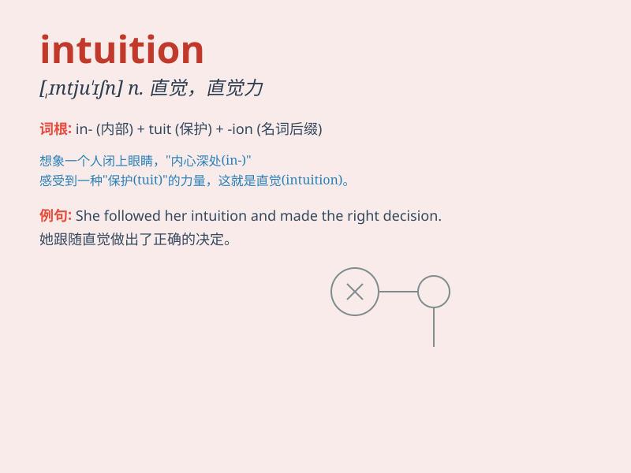

## intuition

**英音:** _[ɪntjʊ\'ɪʃ(ə)n]_ **美音:** _[,ɪntu\'ɪʃən]_

**译义:** *n.直觉,直觉的知识*

### 短语

+ **intuitive thinking:** _直觉思维_

+ **have an intuition:** _有一种直觉_

+ **rely on intuition:** _依靠直觉_

+ **intuition sense:** _直觉感_

+ **sharp intuition:** _敏锐的直觉_

### 例句

#### 例句1

> **My intuition told me that something was wrong.**

**中文翻译:** 我的直觉告诉我有些事情不对劲。

**单词释义:** 直觉

#### 例句2

> **She often makes decisions based on intuition rather than careful
analysis.**

**中文翻译:** 她经常凭直觉而不是仔细分析来做决定。

**单词释义:** 直觉

#### 例句3

> **His intuition led him to the hidden treasure.**

**中文翻译:** 他的直觉引领他找到了隐藏的宝藏。

**单词释义:** 直觉

### 背诵小故事

> One day, Tom was lost in a forest. Without any map or guide, he
followed his intuition and managed to find the way out. Intuition is
like a hidden guide within us that helps us make decisions without
conscious reasoning.

**有一天，汤姆在森林里迷路了。没有任何地图或向导，他凭借直觉成功地找到了出路。直觉就像我们内心隐藏的向导，帮助我们在没有有意识推理的情况下做出决定。**

### 图义

