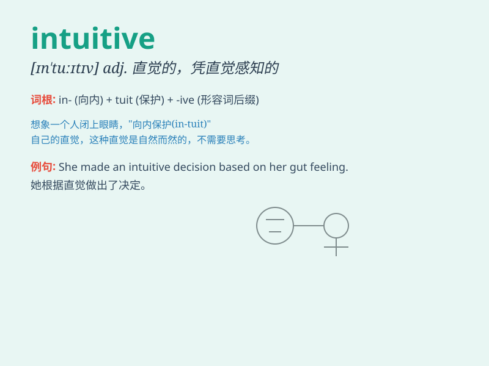

## intuitive

**英音:** _[ɪn\'tjuːɪtɪv]_ **美音:** _[ɪn\'tuɪtɪv]_

**译义:** *adj.直觉的*

### 短语

+ **intuitive thinking:** _直觉思维_

+ **intuitive sense:** _直觉感知_

+ **intuitive understanding:** _直觉理解_

+ **intuitive approach:** _直觉方法_

+ **intuitive judgment:** _直觉判断_

### 例句

#### 例句1

> **Intuitive design makes the software easy to use.**

**中文翻译:** 直观的设计使这个软件易于使用。

**单词释义:** 直观的

#### 例句2

> **She has an intuitive understanding of people\'s emotions.**

**中文翻译:** 她对人们的情绪有一种直觉的理解。

**单词释义:** 直觉的

#### 例句3

> **The intuitive interface of the website attracts many users.**

**中文翻译:** 这个网站的直观界面吸引了很多用户。

**单词释义:** 直观的

### 背诵小故事

> Once, Tom was lost in a strange city. Without any map or guide, he
followed his intuitive feeling and successfully found his way back to
the hotel. Intuitive means relying on instinct or immediate
understanding without conscious reasoning.

**有一次，汤姆在一个陌生的城市迷路了。没有任何地图或向导，他依靠直觉成功地找到了回酒店的路。intuitive
指的是依靠本能或即时的理解，无需有意识的推理。**

### 图义

