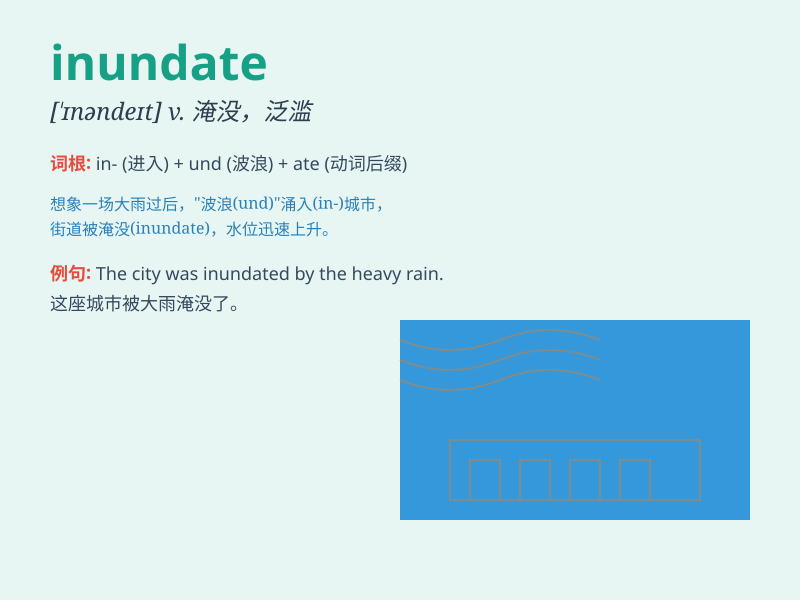

## inundate

**英音:** _[\'ɪnʌndeɪt]_ **美音:** _[\'ɪnʌndet]_

**译义:** *v.淹没*

### 短语

+ **be inundated with:** _被\...\...淹没；充满，充斥_

+ **inundate sb with sth:** _使某人应接不暇；给某人大量的某物_

+ **inundate the market:** _充斥市场_

+ **inundate an area:** _淹没一个地区_

+ **inundate the senses:** _使感官应接不暇_

### 例句

#### 例句1

> **The river burst its banks and inundated the nearby villages.**

**中文翻译:** 这条河决堤了，淹没了附近的村庄。

**单词释义:** 淹没

#### 例句2

> **We were inundated with complaints after the new policy was
introduced.**

**中文翻译:** 新政策出台后，我们收到了大量的投诉。

**单词释义:** 大量涌入

#### 例句3

> **The office was inundated with emails and phone calls.**

**中文翻译:** 办公室里堆满了电子邮件和电话。

**单词释义:** 使充满

### 背诵小故事

>
想象一下，一个小村庄突然遭遇了暴雨，洪水像猛兽一样涌入（inundate）村庄，淹没了房屋和田地。人们惊慌失措，因为洪水来得太猛烈、太多了。

**想象一个村庄突然被洪水大量涌入淹没的场景来辅助记忆\'inundate\'，意思是淹没、泛滥**

### 图义

