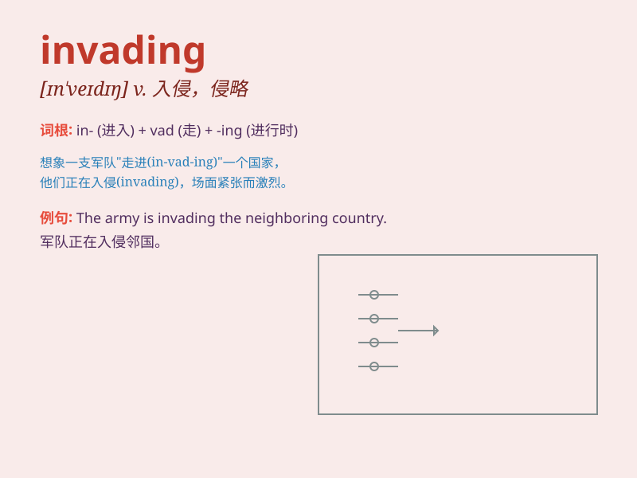

## invading

**英音:** _[ɪnˈveɪdɪŋ]_ **美音:** _[ɪnˈveɪdɪŋ]_

**译义:** *v. 侵略；侵袭；侵扰；涌入（invade 的现在分词）*

### 短语

+ **invading army:** _侵略军_

+ **invading force:** _入侵部队_

+ **invading species:** _入侵物种_

+ **stop invading:** _停止入侵_

+ **prevent invading:** _防止入侵_

### 例句

#### 例句1

> **The invading army was met with fierce resistance from the local
population.**

**中文翻译:** 入侵的军队遭到了当地居民的激烈抵抗。

**单词释义:** 入侵的

#### 例句2

> **The bees were seen as invading our garden.**

**中文翻译:** 这些蜜蜂被视为入侵了我们的花园。

**单词释义:** 入侵；侵犯

#### 例句3

> **He was worried about the invading thoughts that disrupted his
concentration.**

**中文翻译:** 他担心那些侵入的思绪会扰乱他的注意力。

**单词释义:** 侵入的；侵扰的

### 背诵小故事

> A brave soldier was guarding the city. One night, he saw a group of
enemies approaching, trying to invade. He raised the alarm and fought
bravely to stop the invading force.

**一位勇敢的士兵正在守卫城市。一天晚上，他看到一群敌人靠近，试图入侵。他拉响警报并英勇战斗以阻止入侵的部队。**

### 图义

