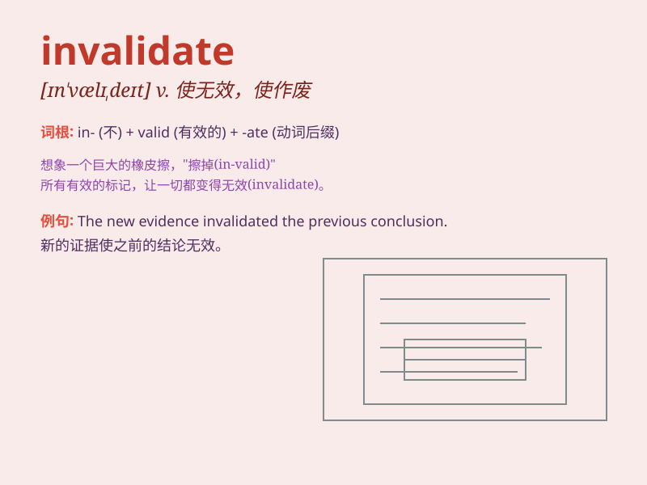

## invalidate

**英音:** _[ɪn\'vælɪdeɪt]_ **美音:** _[ɪn\'vælɪdet]_

**译义:** *vt.使无效*

### 短语

+ **invalidate a contract:** _使合同无效_

+ **invalidate an argument:** _使论点站不住脚_

+ **invalidate a passport:** _使护照失效_

+ **invalidate a theory:** _推翻一个理论_

+ **invalidate a vote:** _使选票无效_

### 例句

#### 例句1

> **The new evidence invalidates his alibi.**

**中文翻译:** 新的证据使他的不在场证明无效。

**单词释义:** 使无效

#### 例句2

> **Her illness invalidated the contract.**

**中文翻译:** 她的疾病使合同无效。

**单词释义:** 使无效

#### 例句3

> **The court decision invalidated the previous ruling.**

**中文翻译:** 法院的裁决使之前的裁定无效。

**单词释义:** 使无效

### 背诵小故事

> A scientist spent years on a theory, but new evidence emerged and
invalidated it. His hard work seemed wasted, making him very sad.
\'Invalidate\' means to make something invalid or null and void.

**一位科学家花了数年时间研究一个理论，但新的证据出现并使其无效。他的努力似乎白费了，这让他非常伤心。\'invalidate\'意思是使无效或作废。**

### 图义

