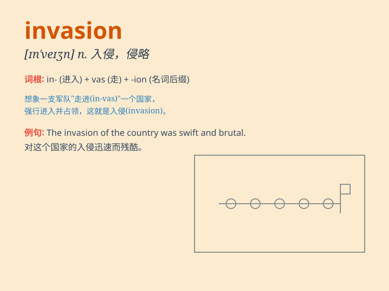

## invasion

**英音:** _[ɪn\'veɪʒ(ə)n]_ **美音:** _[ɪn\'veʒn]_

**译义:** *n.入侵*

### 短语

+ **military invasion:** _军事入侵_

+ **invasion of privacy:** _侵犯隐私_

+ **prevent an invasion:** _防止入侵_

+ **resist an invasion:** _抵抗入侵_

+ **launch an invasion:** _发动入侵_

### 例句

#### 例句1

> **The invasion of Normandy was a crucial event in World War II.**

**中文翻译:** 诺曼底的入侵是第二次世界大战中的一个关键事件。

**单词释义:** 入侵；侵略

#### 例句2

> **The country was prepared to resist any foreign invasion.**

**中文翻译:** 这个国家准备抵抗任何外国的侵略。

**单词释义:** 入侵；侵略

#### 例句3

> **The invasion of privacy by the paparazzi is unacceptable.**

**中文翻译:** 狗仔队侵犯隐私的行为是不可接受的。

**单词释义:** 侵犯；侵扰

### 背诵小故事

> One day, a peaceful town was suddenly faced with an invasion. Strange
soldiers came in large numbers, causing chaos and fear. People had to
unite to defend their homeland from this unwanted invasion.

**有一天，一个宁静的小镇突然面临入侵。大量陌生的士兵涌来，造成了混乱和恐慌。人们不得不团结起来，保卫他们的家园免受这场不受欢迎的入侵。**

### 图义

