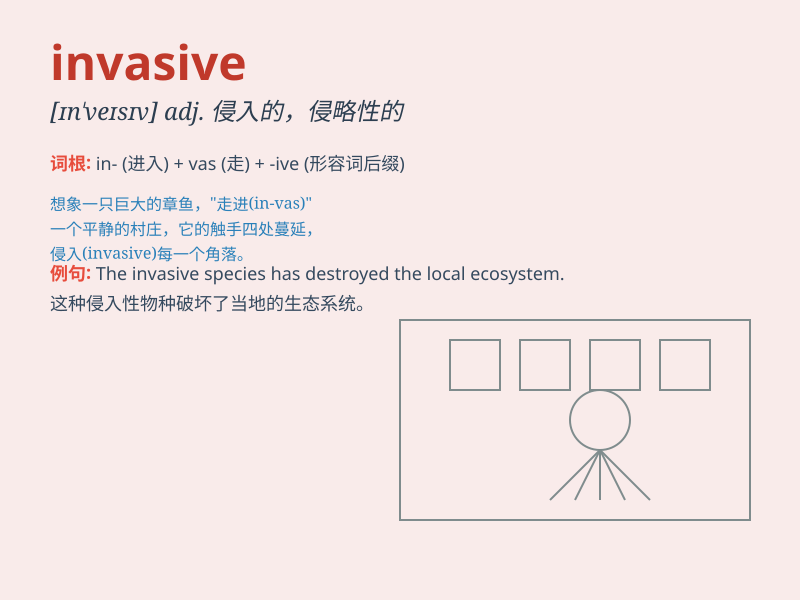

## invasive

**英音:** _[ɪn\'veɪsɪv]_ **美音:** _[ɪn\'vesɪv]_

**译义:** *adj.入侵的*

### 短语

+ **invasive species:** _入侵物种_

+ **invasive procedure:** _侵入性程序；有创操作_

+ **invasive cancer:** _浸润性癌；侵袭性癌症_

+ **invasive plant:** _入侵植物_

+ **invasive growth:** _侵入性生长；侵袭性生长_

### 例句

#### 例句1

> **The invasive species is causing significant damage to the local
ecosystem.**

**中文翻译:** 这种入侵物种正在对当地的生态系统造成重大损害。

**单词释义:** 入侵的；侵入的

#### 例句2

> **She had an invasive medical procedure to treat her illness.**

**中文翻译:** 她接受了一种侵入性的医疗程序来治疗她的疾病。

**单词释义:** 侵入性的

#### 例句3

> **The invasive plants are spreading rapidly in the garden.**

**中文翻译:** 这些入侵植物在花园里迅速蔓延。

**单词释义:** 入侵的

### 背诵小故事

>
想象一下，一群凶猛的外星人入侵（invasive）地球。他们强行进入，毫不客气，就像不受欢迎的不速之客。这种强行闯入的行为就是\'invasive\'。

**想象一群外星人强行入侵地球的情景来辅助记忆\'invasive\'这个单词，意思是侵入的；侵略性的；攻击性的**

### 图义

