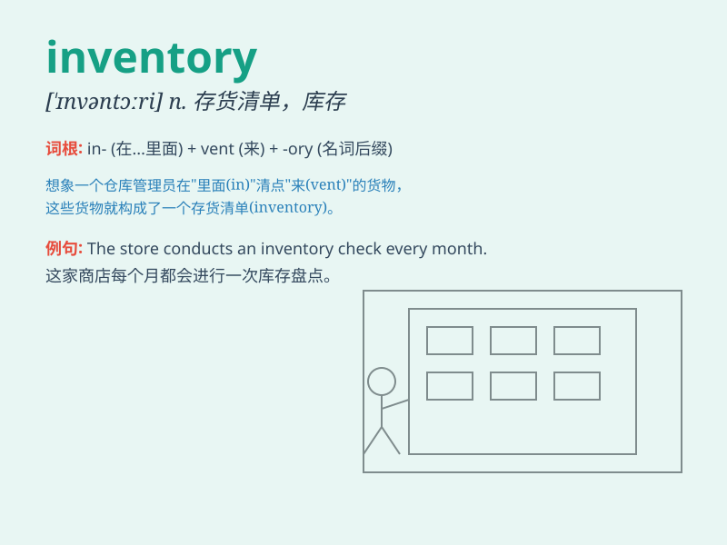

## inventory

**英音:** _[\'ɪnv(ə)nt(ə)rɪ]_ **美音:** _[\'ɪnvəntɔri]_

**译义:** *n.详细目录,存货,财产清册,总量*

### 短语

+ **inventory control:** _库存控制_

+ **inventory management:** _库存管理_

+ **inventory system:** _库存系统_

+ **take inventory:** _盘点；清查存货_

+ **inventory list:** _存货清单_

### 例句

#### 例句1

> **The store manager is conducting a monthly inventory of the
goods.**

**中文翻译:** 商店经理正在对商品进行每月的盘点。

**单词释义:** 盘点；清查

#### 例句2

> **The company\'s inventory includes a wide range of products.**

**中文翻译:** 这家公司的库存包括各种各样的产品。

**单词释义:** 库存；存货

#### 例句3

> **They need to update the inventory system to improve
efficiency.**

**中文翻译:** 他们需要更新库存系统以提高效率。

**单词释义:** 库存清单；详细目录

### 背诵小故事

> A store owner was very worried because he couldn\'t keep track of his
inventory. One day, he decided to make a detailed list and found out
what was missing and what was in excess. Now, he managed his inventory
well.

**一位商店老板非常担心，因为他无法跟踪他的库存。有一天，他决定做一个详细的清单，弄清楚什么缺货，什么过剩。现在，他很好地管理了他的库存。**

### 图义

