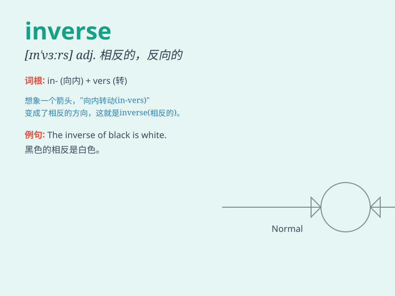

## inverse

**英音:** _[\'ɪnvɜːs; ɪn\'vɜːs]_ **美音:** _[,ɪn\'vɝs]_

**译义:** *adj.倒转的,反转的n.反面v.倒转*

### 短语

+ **inverse function:** _反函数_

+ **inverse proportion:** _反比例；反比_

+ **inverse relationship:** _逆关系；反向关系_

+ **inverse matrix:** _逆矩阵_

+ **inverse operation:** _逆运算_

### 例句

#### 例句1

> **The relationship between the two variables is inverse.**

**中文翻译:** 这两个变量之间的关系是相反的。

**单词释义:** 相反的

#### 例句2

> **The inverse of success is failure.**

**中文翻译:** 成功的反面是失败。

**单词释义:** 反面；相反

#### 例句3

> **The inverse function can be used to solve this problem.**

**中文翻译:** 反函数可以用来解决这个问题。

**单词释义:** 反的；逆的

### 背诵小故事

>
想象一下，有一个神奇的数学王国。在那里，正常的规则都被颠倒。比如加法变成减法，乘法变成除法。这种颠倒的情况就叫\'inverse\'。就像镜子里的相反影像一样。

**想象在数学王国中，正常规则颠倒的情况被称为\'inverse\'，如同镜子里的相反影像**

### 图义

