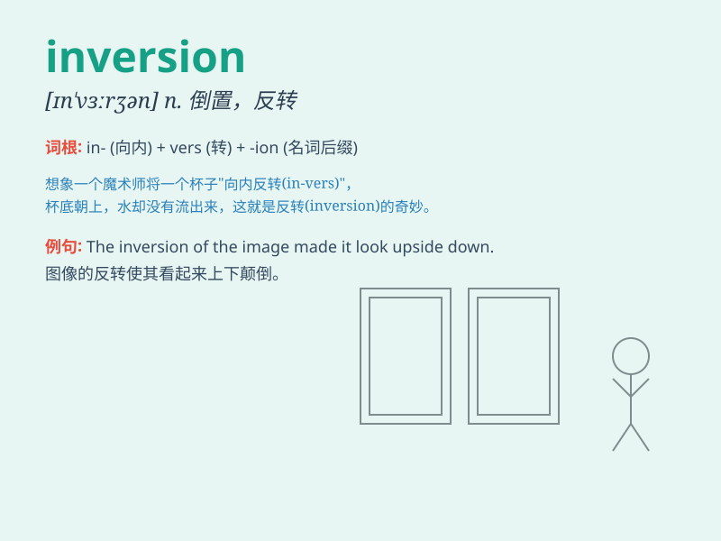

## inversion

**英音:** _[ɪn\'vɜːʃ(ə)n]_ **美音:** _[ɪn\'vɝʃən]_

**译义:** *n.倒置*

### 短语

+ **inversion layer:** _逆温层_

+ **chromosomal inversion:** _染色体倒位_

+ **inversion of control:** _控制反转_

+ **thermal inversion:** _热逆温_

+ **inversion symmetry:** _反演对称性_

### 例句

#### 例句1

> **The inversion of the normal order caused confusion.**

**中文翻译:** 正常顺序的颠倒引起了混乱。

**单词释义:** 颠倒；倒置

#### 例句2

> **Inversion therapy can help relieve back pain.**

**中文翻译:** 倒挂疗法有助于缓解背部疼痛。

**单词释义:** 倒挂；倒转

#### 例句3

> **The inversion of temperature is a rare phenomenon in this
area.**

**中文翻译:** 温度的逆转在这个地区是一种罕见的现象。

**单词释义:** 逆转；反转

### 背诵小故事

> A prince was lost in a strange forest. One day, he found an
inversion - everything was upside down. The trees had their roots in the
air, and the birds swam in the river. It was a magical and confusing
inversion.

**一位王子在一片陌生的森林里迷路了。有一天，他发现了一种倒置------一切都上下颠倒了。树木的根在空中，鸟儿在河里游。这是一种神奇而令人困惑的倒置。**

### 图义

