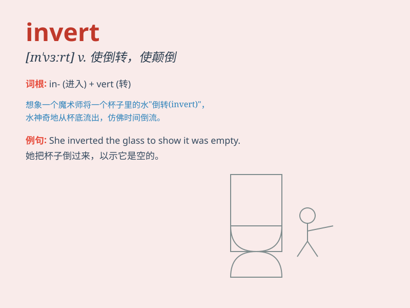

## invert

**英音:** _[ɪn\'vɜːt]_ **美音:** _[\'ɪnvɝt]_

**译义:** *adj.转化的vt.使颠倒,使转化n.颠倒的事物*

### 短语

+ **invert sugar:** _转化糖_

+ **invert triangle:** _倒三角形_

+ **invert thinking:** _逆向思维_

+ **invert order:** _颠倒顺序_

+ **invert colors:** _反转颜色_

### 例句

#### 例句1

> **Invert the glass to empty the water.**

**中文翻译:** 把杯子倒过来把水倒空。

**单词释义:** 使倒转，使颠倒

#### 例句2

> **The magician managed to invert the order of the cards.**

**中文翻译:** 魔术师设法颠倒了纸牌的顺序。

**单词释义:** 颠倒，反转

#### 例句3

> **You need to invert the image for a better view.**

**中文翻译:** 你需要把图像反转以获得更好的视图。

**单词释义:** 反转，倒置

### 背诵小故事

>
想象一下，有一个神奇的镜子，当你站在它面前，它会把你的上下颠倒，这就是\'invert\'。就像把正常的顺序反转，比如把杯子倒过来，让底部朝上，这就是\'invert\'的意思。

**想象有个神奇镜子会颠倒你的上下，就像把杯子倒过来，这解释了\'invert\'意为颠倒、反转。**

### 图义

