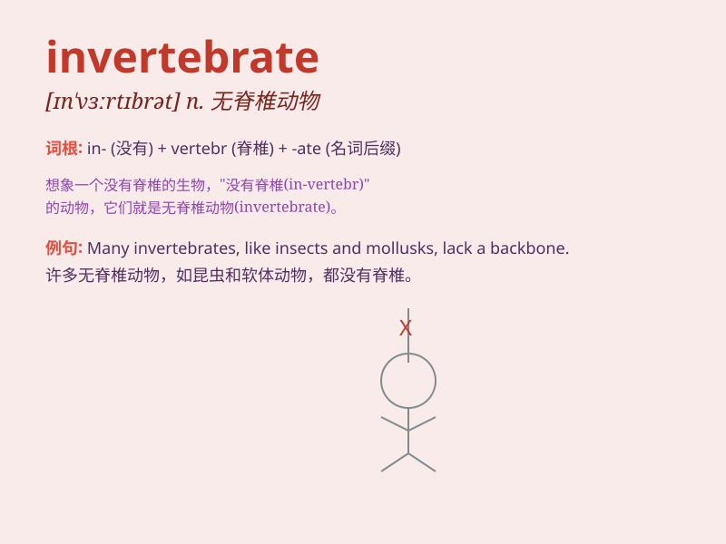

## invertebrate

**英音:** _[ɪn\'vɜːtɪbrət]_ **美音:** _[ɪn\'vɝtɪbret]_

**译义:** *adj.无脊椎的,无骨气的n.无脊椎动物,无骨气的人*

### 短语

+ **invertebrate animals:** _无脊椎动物_

+ **aquatic invertebrates:** _水生无脊椎动物_

+ **terrestrial invertebrates:** _陆生无脊椎动物_

+ **marine invertebrates:** _海洋无脊椎动物_

+ **invertebrate fossils:** _无脊椎动物化石_

### 例句

#### 例句1

> **Most invertebrates have a soft body.**

**中文翻译:** 大多数无脊椎动物都有柔软的身体。

**单词释义:** 无脊椎动物

#### 例句2

> **The study of invertebrates is fascinating.**

**中文翻译:** 对无脊椎动物的研究很迷人。

**单词释义:** 无脊椎动物

#### 例句3

> **Invertebrates are an important part of the ecosystem.**

**中文翻译:** 无脊椎动物是生态系统的重要组成部分。

**单词释义:** 无脊椎动物

### 背诵小故事

>
想象一下，在神秘的海底世界，有一群没有脊椎骨的生物在欢快游动，它们就是
invertebrate 无脊椎动物。比如柔软的水母、缓慢的蜗牛。记住这些，就能记住
invertebrate 啦。

**想象在海底一群没有脊椎骨的生物，比如水母、蜗牛，以此记住
invertebrate 无脊椎动物这个单词。**

### 图义

