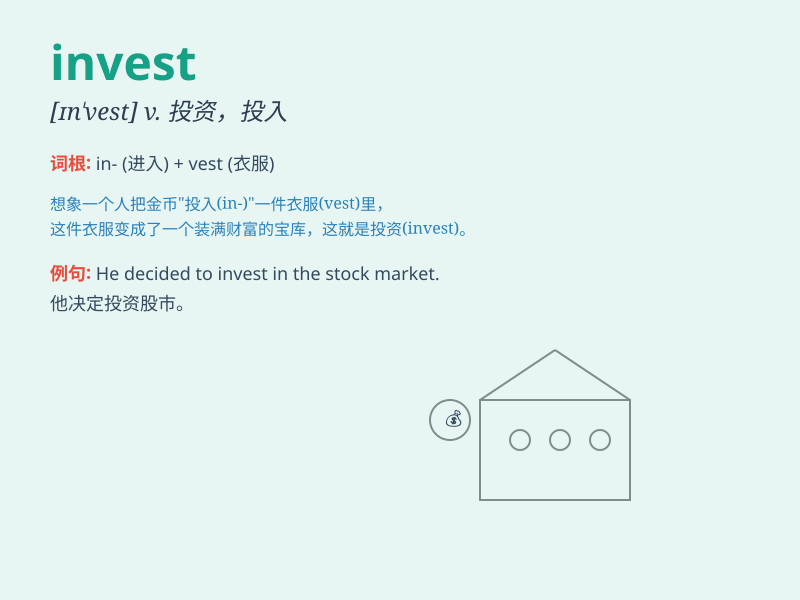

## invest

**英音:** _[ɪn\'vest]_ **美音:** _[ɪn\'vɛst]_

**译义:** *v.投(资),购买(有用之物)～,授予,投资*

### 短语

+ **invest in:** _投资于；在...方面投资_

+ **invest money:** _投资金钱_

+ **invest heavily:** _大量投资_

+ **invest time:** _投入时间_

+ **invest effort:** _投入精力_

### 例句

#### 例句1

> **He decided to invest in the stock market.**

**中文翻译:** 他决定投资股市。

**单词释义:** 投资

#### 例句2

> **The company is willing to invest heavily in research and
development.**

**中文翻译:** 这家公司愿意在研发方面大量投资。

**单词释义:** 投入（资金等）

#### 例句3

> **She invested a lot of time and effort in her studies.**

**中文翻译:** 她在学习上投入了大量的时间和精力。

**单词释义:** 投入（时间、精力等）

### 背诵小故事

> A young entrepreneur decided to invest all his savings in a new tech
startup. He believed in its potential and was willing to take the risk.
With time and effort, his investment paid off and he became very
successful.

**一位年轻的企业家决定把他所有的积蓄都投资到一家新的科技创业公司。他相信它的潜力，愿意冒险。随着时间和努力，他的投资得到了回报，他变得非常成功。**

### 图义

