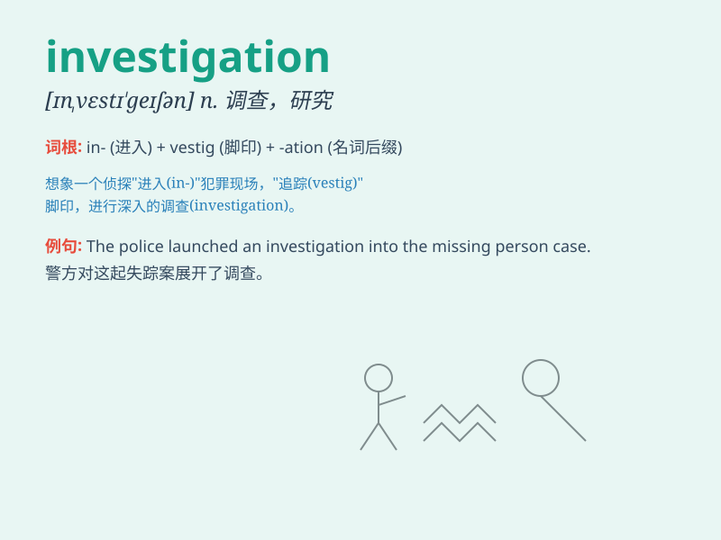

## investigation

**英音:** _[ɪn,vestɪ\'geɪʃ(ə)n]_ **美音:**
_[ɪn,vɛstɪ\'ɡeʃən]_

**译义:** *n.调查,研究*

### 短语

+ **criminal investigation:** _刑事调查_

+ **investigation report:** _调查报告_

+ **scientific investigation:** _科学调查_

+ **under investigation:** _在调查中_

+ **conduct an investigation:** _进行一项调查_

### 例句

#### 例句1

> **The police are conducting an investigation into the robbery.**

**中文翻译:** 警方正在对这起抢劫案进行调查。

**单词释义:** 调查

#### 例句2

> **The scientist\'s investigation led to a breakthrough in cancer
research.**

**中文翻译:** 这位科学家的研究调查带来了癌症研究的突破。

**单词释义:** 调查；研究

#### 例句3

> **The company launched an internal investigation to find the cause
of the data breach.**

**中文翻译:** 公司展开了内部调查以找出数据泄露的原因。

**单词释义:** 调查

### 背诵小故事

> A detective was on an investigation. He spent days looking for clues,
interviewing people, and following leads. Finally, his hard work paid
off and he solved the mystery. Remember, investigation means a careful
search to find out the truth.

**一位侦探正在进行调查。他花了好几天寻找线索、询问人员和追踪线索。最后，他的努力得到了回报，他解开了谜团。记住，investigation
意思是仔细搜寻以查明真相。**

### 图义

