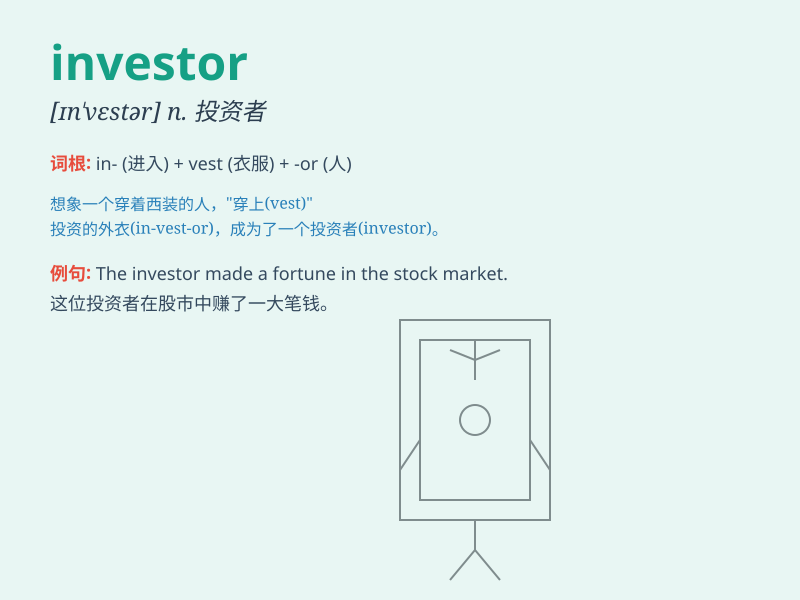

## investor

**英音:** _[ɪn\'vestə]_ **美音:** _[ɪn\'vɛstɚ]_

**译义:** *n.投资者*

### 短语

+ **institutional investor:** _机构投资者_

+ **foreign investor:** _外国投资者_

+ **potential investor:** _潜在投资者_

+ **private investor:** _私人投资者_

+ **angel investor:** _天使投资者_

### 例句

#### 例句1

> **The investor was cautious about the new startup.**

**中文翻译:** 这位投资者对新的初创公司很谨慎。

**单词释义:** 投资者

#### 例句2

> **We need to attract more foreign investors to boost the
economy.**

**中文翻译:** 我们需要吸引更多的外国投资者来促进经济发展。

**单词释义:** 投资者

#### 例句3

> **The experienced investor made a fortune in the stock market.**

**中文翻译:** 这位经验丰富的投资者在股市赚了一大笔钱。

**单词释义:** 投资者

### 背诵小故事

>
想象一下，有个聪明的人拿着一大笔钱，到处寻找能让钱生钱的机会。他就像一个探险家，不断投入资金，这个人就是
investor （投资者），他们勇敢地冒险，期望获得丰厚的回报。

**想象有个聪明的人拿着钱到处寻找投资机会来解释单词'投资者'**

### 图义

