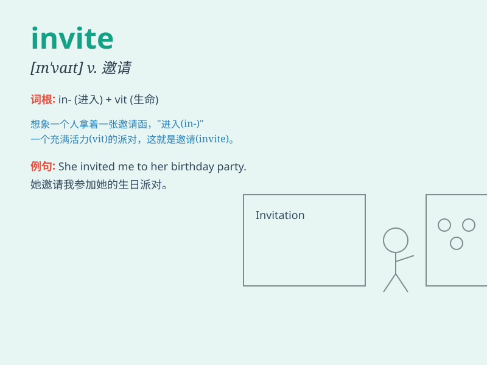

## invite

**英音:** _[ɪn\'vaɪt]_ **美音:** _[ɪn\'vaɪt]_

**译义:** *vt.邀请,引起n.邀请*

### 短语

+ **invite sb. to do sth.:** _邀请某人做某事_

+ **invite sb. to sp.:** _邀请某人去某地_

+ **be invited to do sth.:** _被邀请做某事_

+ **send an invite:** _发出邀请_

+ **accept an invite:** _接受邀请_

### 例句

#### 例句1

> **I invited my friends to my birthday party.**

**中文翻译:** 我邀请了我的朋友们来参加我的生日聚会。

**单词释义:** 邀请

#### 例句2

> **They invited us to have dinner at their house.**

**中文翻译:** 他们邀请我们去他们家吃晚餐。

**单词释义:** 邀请

#### 例句3

> **She was invited to give a speech at the conference.**

**中文翻译:** 她被邀请在会议上发言。

**单词释义:** 被邀请

### 背诵小故事

> One day, Tom wanted to have a party. He wrote many letters to invite
his friends. He was excited and hoped everyone would come. The word
\'invite\' means to ask someone to come or do something.

**有一天，汤姆想要举办一个派对。他写了很多信去邀请他的朋友们。他很兴奋，希望每个人都能来。单词\'invite\'意思是请求某人来或做某事。**

### 图义

