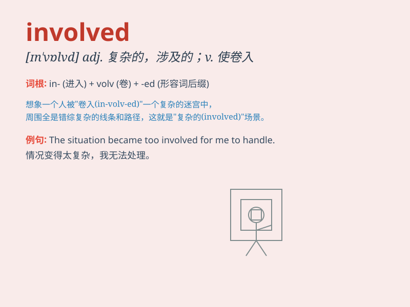

## involved

**英音:** _[ɪn\'vɒlvd]_ **美音:** _[ɪn\'vɑlvd]_

**译义:** *adj.棘手的,有关的*

### 短语

+ **be involved in:** _参与；卷入；与......有关联_

+ **get involved:** _介入；参与；卷入_

+ **involved with:** _与......有牵连；与......有关系_

+ **become involved:** _变得卷入；变得参与_

+ **deeply involved:** _深深卷入；深度参与_

### 例句

#### 例句1

> **I don\'t want to get involved in their argument.**

**中文翻译:** 我不想卷入他们的争论。

**单词释义:** 卷入；参与

#### 例句2

> **The project is very complex and involves many different
departments.**

**中文翻译:** 这个项目非常复杂，涉及许多不同的部门。

**单词释义:** 涉及；包含

#### 例句3

> **She was deeply involved in the planning of the event.**

**中文翻译:** 她深入参与了这个活动的策划。

**单词释义:** 参与；投入

### 背诵小故事

> A girl was involved in a mysterious adventure. She found a hidden
cave and got lost. But with her courage and wisdom, she finally found
the way out. \'Involved\' here means to be part of something.

**一个女孩卷入了一场神秘的冒险。她发现了一个隐藏的洞穴然后迷路了。但凭借她的勇气和智慧，她最终找到了出路。\'involved\'在这里表示成为某事的一部分。**

### 图义

