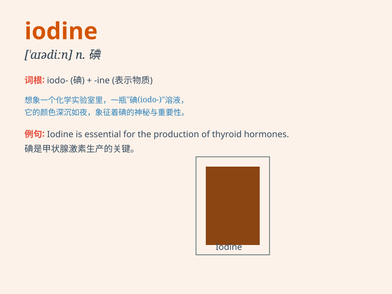

## iodine

**英音:** _[\'aɪədiːn; -aɪn; -ɪn]_ **美音:** _[aɪədaɪn]_

**译义:** *n.碘,碘酒*

### 短语

+ **iodine solution:** _碘溶液_

+ **iodine deficiency:** _碘缺乏_

+ **iodine test:** _碘试验_

+ **iodine tincture:** _碘酊_

+ **iodine atom:** _碘原子_

### 例句

#### 例句1

> **Iodine is often used in medicine to disinfect wounds.**

**中文翻译:** 碘经常在医学中被用于给伤口消毒。

**单词释义:** 碘

#### 例句2

> **The doctor applied iodine to the patient\'s cut.**

**中文翻译:** 医生在病人的伤口上涂了碘。

**单词释义:** 碘

#### 例句3

> **Iodine deficiency can cause thyroid problems.**

**中文翻译:** 碘缺乏会导致甲状腺问题。

**单词释义:** 碘

### 背诵小故事

> One day, a scientist was doing an experiment. He needed iodine to
make a special potion. But he couldn\'t find it easily. Finally, he
discovered iodine in a hidden corner of the lab. With iodine, his
experiment was successful.

**一天，一位科学家正在做实验。他需要碘来制作一种特殊的药剂。但他不容易找到它。最后，他在实验室的一个隐蔽角落里发现了碘。有了碘，他的实验成功了。**

### 图义

