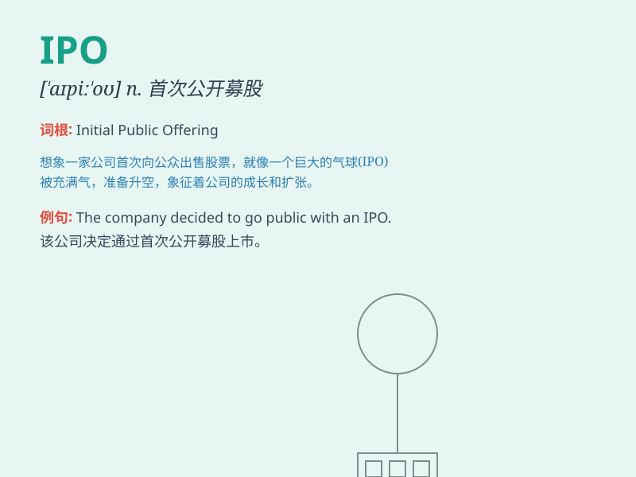

## IPO

**英音:** _[ˌaɪ pi ˈoʊ]_ **美音:** _[ˌaɪ pi ˈoʊ]_

**译义:** *abbr. 首次公开募股（Initial Public
Offering），指一家公司首次将其股份向公众出售，以便在证券市场上筹集资金。*

### 短语

+ **IPO process:** _首次公开募股流程_

+ **IPO market:** _首次公开募股市场_

+ **IPO listing:** _首次公开募股上市_

+ **IPO application:** _首次公开募股申请_

+ **IPO prospectus:** _首次公开募股招股说明书_

### 例句

#### 例句1

> **The company is planning an IPO to raise funds for expansion.**

**中文翻译:** 这家公司正计划首次公开募股以筹集扩张资金。

**单词释义:** 首次公开募股

#### 例句2

> **The success of the IPO depends on market conditions.**

**中文翻译:** 首次公开募股的成功取决于市场状况。

**单词释义:** 首次公开募股

#### 例句3

> **Investors are closely watching the upcoming IPO.**

**中文翻译:** 投资者们正在密切关注即将到来的首次公开募股。

**单词释义:** 首次公开募股

### 背诵小故事

> 想象一家初创公司，努力发展，终于迎来了 IPO
时刻。员工们兴奋不已，因为这意味着公司要在股市公开出售股票，吸引大量投资，走向更大的成功。

**想象一家初创公司经历
IPO（首次公开募股）的情景，员工兴奋，公司将在股市公开售股吸引投资走向成功。**

### 图义

