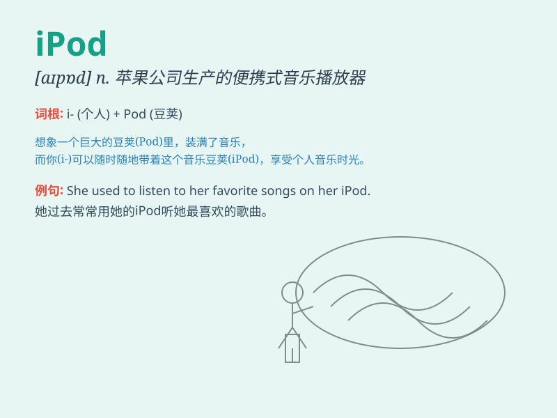

## IPod

**英音:** _[aɪpɒd]_ **美音:** _[aɪpɑd]_

**译义:** *n. iPod（苹果公司推出的一种便携式数字多媒体播放器）*

### 短语

+ **IPod touch:** _iPod 触摸款_

+ **IPod classic:** _iPod 经典款_

+ **IPod nano:** _iPod 纳诺款_

+ **IPod shuffle:** _iPod 随机播放款_

+ **IPod accessories:** _iPod 配件_

### 例句

#### 例句1

> **I love listening to music on my iPod when I\'m on the train.**

**中文翻译:** 我在火车上时喜欢用我的 iPod 听音乐。

**单词释义:** 苹果公司的一款便携式音乐播放器

#### 例句2

> **She lost her iPod and was very sad.**

**中文翻译:** 她弄丢了她的 iPod ，非常伤心。

**单词释义:** 苹果公司的一款便携式音乐播放器

#### 例句3

> **The new iPod has more storage capacity than the old one.**

**中文翻译:** 新的 iPod 比旧的存储容量更大。

**单词释义:** 苹果公司的一款便携式音乐播放器

### 背诵小故事

> One day, I was walking on the street feeling lost and alone.
Suddenly, an iPod in a store window caught my eye. Its sleek design and
promise of wonderful music made me smile. With the iPod, my mood lifted
and I found my way back to happiness.

**有一天，我走在街上感到迷茫和孤独。突然，商店橱窗里的一个 iPod
吸引了我的目光。它时尚的设计和美妙音乐的承诺让我微笑。有了
iPod，我的心情变好，找到了回归快乐的路。**

### 图义

