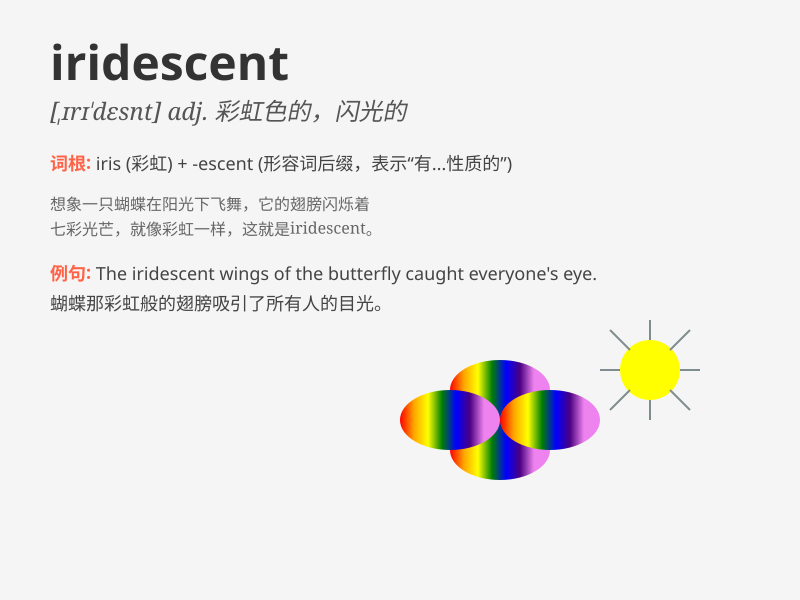

## iridescent

**英音:** _[,ɪrɪ\'des(ə)nt]_ **美音:** _[,ɪrɪ\'dɛsnt]_

**译义:** *adj.彩虹色的,闪光的*

### 短语

+ **iridescent colors:** _彩虹色_

+ **iridescent light:** _彩虹般的光_

+ **iridescent cloud:** _彩云_

+ **iridescent bubble:** _彩虹色的泡泡_

+ **iridescent feather:** _彩虹色的羽毛_

### 例句

#### 例句1

> **The iridescent wings of the butterfly were a sight to behold.**

**中文翻译:** 蝴蝶那彩虹色的翅膀美丽非凡，令人惊叹。

**单词释义:** 彩虹色的；色彩斑斓的

#### 例句2

> **The oil slick on the water surface showed an iridescent
sheen.**

**中文翻译:** 水面上的浮油呈现出彩虹般的光泽。

**单词释义:** 色彩斑斓的；闪耀的

#### 例句3

> **She wore an iridescent scarf that caught everyone\'s
attention.**

**中文翻译:** 她戴了一条色彩绚烂的围巾，吸引了所有人的注意。

**单词释义:** 色彩绚烂的；耀眼的

### 背诵小故事

> A magical unicorn galloped through a rainbow, and its horn shone with
an iridescent light. The colors shifted and changed, making it a wonder
to behold. It means showing many changing colors that are very bright
and beautiful.

**一只神奇的独角兽在彩虹中奔跑，它的角闪耀着彩虹般的光芒。颜色不断变化，美轮美奂。这个词意思是色彩斑斓闪耀的。**

### 图义

