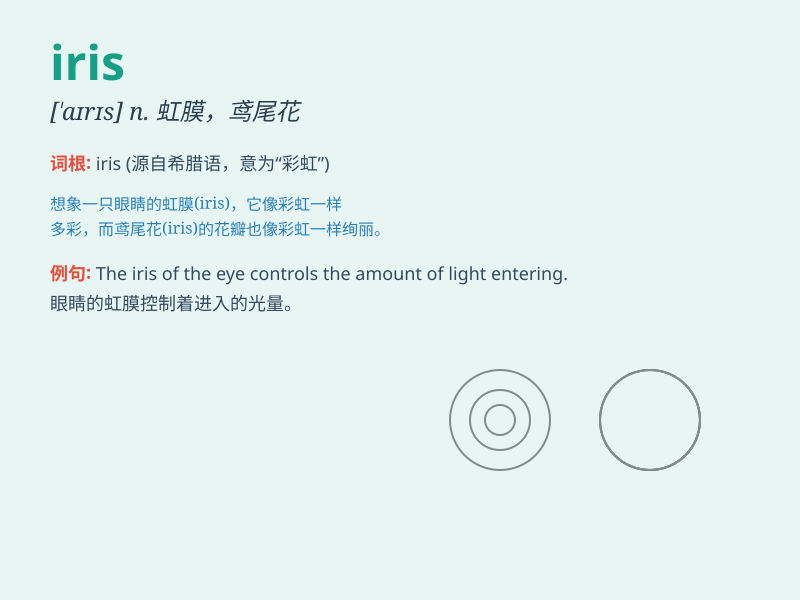

## iris

**英音:** _[\'aɪrɪs]_ **美音:** _[\'aɪrɪs]_

**译义:** *n.[解]虹膜,鸢尾属植物,[希神]彩虹之女神,虹,虹彩*

### 短语

+ **iris diaphragm:** _可变光阑；虹彩光阑_

+ **iris root:** _鸢尾根_

+ **iris scanner:** _虹膜扫描仪_

+ **iris flower:** _鸢尾花_

+ **iris petal:** _鸢尾花瓣_

### 例句

#### 例句1

> **The iris of her eye was a beautiful shade of blue.**

**中文翻译:** 她眼睛的虹膜是美丽的蓝色。

**单词释义:** 虹膜

#### 例句2

> **The garden was filled with various types of irises.**

**中文翻译:** 花园里种满了各种各样的鸢尾花。

**单词释义:** 鸢尾花

#### 例句3

> **The camera\'s iris adjusted to the changing light conditions.**

**中文翻译:** 相机的光圈根据变化的光线条件进行了调整。

**单词释义:** 光圈

### 背诵小故事

> Iris was a beautiful fairy who had eyes as charming as the colors of
a rainbow. One day, she transformed into a flower with petals as
colorful as her eyes. That flower was named iris, symbolizing beauty and
charm.

**艾莉丝是一位美丽的仙女，她的眼睛如彩虹般迷人。有一天，她变成了一朵花，花瓣如她的眼睛般色彩斑斓。这朵花就被命名为
iris，象征着美丽和魅力。**

### 图义

