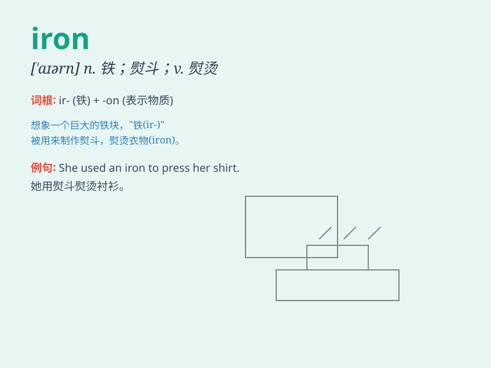

## iron

**英音:** _[\'aɪən]_ **美音:** _[\'aɪɚn]_

**译义:** *n.铁,熨斗,坚强,烙铁,镣铐vt.烫平,熨,用铁装备vi.烫衣服*

### 短语

+ **iron out:** _消除；解决；熨平_

+ **cast iron:** _铸铁；生铁_

+ **wrought iron:** _熟铁；锻铁_

+ **iron hand:** _铁腕；强硬手段_

+ **iron deficiency:** _缺铁；缺铁症_

### 例句

#### 例句1

> **She ironed the shirt to remove the wrinkles.**

**中文翻译:** 她熨烫衬衫以去除褶皱。

**单词释义:** 熨烫

#### 例句2

> **The man has an iron will and never gives up easily.**

**中文翻译:** 这个男人有钢铁般的意志，从不轻易放弃。

**单词释义:** 钢铁般的

#### 例句3

> **The iron gate was rusty and needed to be painted.**

**中文翻译:** 那扇铁门生锈了，需要上漆。

**单词释义:** 铁制的

### 背诵小故事

> A blacksmith was working hard in his forge. He heated the iron until
it glowed red, then hammered it into shape. The iron was strong and
could be made into various useful tools.

**一位铁匠在他的锻造间努力工作。他加热铁块直到它发红，然后把它锤打成型。铁块很坚固，可以被制成各种有用的工具。**

### 图义

