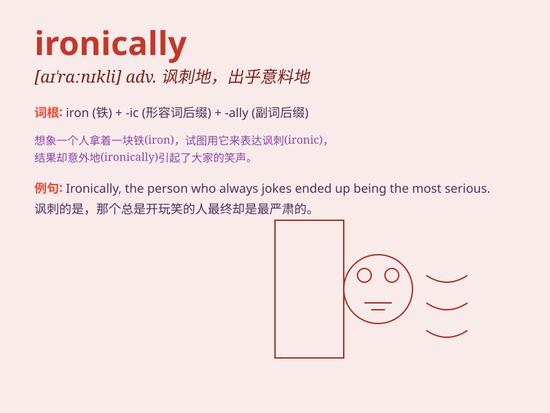

## ironically

**英音:** _[aɪ\'rɒnɪklɪ]_ **美音:** _[aɪ\'rɑnɪkli]_

**译义:** *adv.说反话地,讽刺地*

### 短语

+ **Ironically enough:** _具有讽刺意味的是；真够讽刺的_

+ **speak ironically:** _讽刺地说_

+ **act ironically:** _以讽刺的方式行事_

+ **look ironically:** _带着讽刺的神情看_

+ **write ironically:** _以讽刺的笔调写_

### 例句

#### 例句1

> **Ironically, the medicine that was supposed to cure her made her
condition worse.**

**中文翻译:** 具有讽刺意味的是，本应治愈她的药却使她的病情恶化了。

**单词释义:** 具有讽刺意味地

#### 例句2

> **He ended up losing the game, ironically, after being so confident
of winning.**

**中文翻译:**
具有讽刺意味的是，在他如此自信会赢之后，最终却输掉了比赛。

**单词释义:** 具有讽刺意味地

#### 例句3

> **Ironically, the person who always preached about saving money
spent the most.**

**中文翻译:** 讽刺的是，那个总是鼓吹省钱的人花得最多。

**单词释义:** 讽刺地

### 背诵小故事

> A man always boasted that he was never late. Ironically, on the most
important day of his life, he was late and missed the chance. This shows
the unexpected and contrary situation that \'ironically\' represents.

**一个男人总是吹嘘自己从不迟到。具有讽刺意味的是，在他一生中最重要的一天，他迟到了并错过了机会。这展示了'ironically'所代表的出乎意料和相反的情况。**

### 图义

