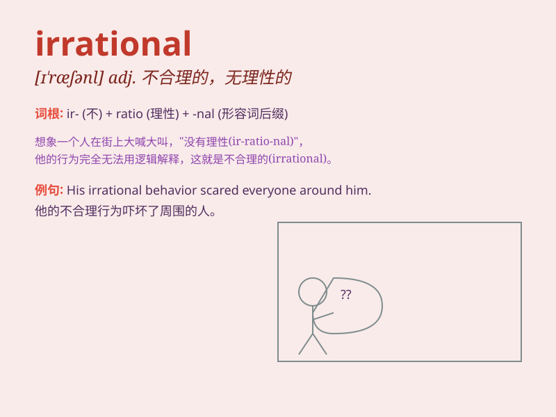

## irrational

**英音:** _[ɪ\'ræʃ(ə)n(ə)l]_ **美音:** _[ɪ\'ræʃənl]_

**译义:** *adj.无理性的,失去理性的*

### 短语

+ **irrational number:** _无理数_

+ **irrational fear:** _无端的恐惧_

+ **irrational behavior:** _不合理的行为_

+ **irrational belief:** _荒谬的信仰_

+ **irrational decision:** _非理性的决定_

### 例句

#### 例句1

> **His fear of spiders is completely irrational.**

**中文翻译:** 他对蜘蛛的恐惧完全是没有道理的。

**单词释义:** 没有道理的；不合理的

#### 例句2

> **The decision was based on irrational motives.**

**中文翻译:** 这个决定是基于非理性的动机。

**单词释义:** 非理性的

#### 例句3

> **She had an irrational belief that she would never find love.**

**中文翻译:** 她有一种不合理的信念，认为自己永远找不到爱情。

**单词释义:** 不合理的

### 背诵小故事

> Once upon a time, a math wizard was dealing with a number that
couldn\'t be expressed as a simple fraction. He called it
\'irrational\', meaning not based on reason or logic in the world of
numbers.

**从前，有一个数学巫师在处理一个不能表示为简单分数的数字。他称其为"irrational"，意思是在数字世界中没有基于理性或逻辑。**

### 图义

