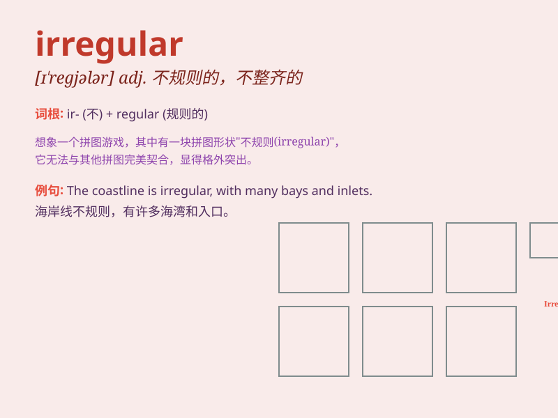

## irregular

**英音:** _[ɪ\'regjʊlə]_ **美音:** _[ɪ\'rɛɡjəlɚ]_

**译义:** *adj.不规则的,无规律的*

### 短语

+ **irregular verb:** _不规则动词_

+ **irregular heartbeat:** _不规则心跳_

+ **irregular shape:** _不规则形状_

+ **irregular schedule:** _不规律的日程安排_

+ **irregular customer:** _不定期的顾客_

### 例句

#### 例句1

> **The coastline is highly irregular, with many bays and inlets.**

**中文翻译:** 这条海岸线非常不规则，有许多海湾和小水湾。

**单词释义:** 不规则的

#### 例句2

> **He has irregular working hours and often works late into the
night.**

**中文翻译:** 他的工作时间不规律，经常工作到深夜。

**单词释义:** 不规律的

#### 例句3

> **The irregular troops were poorly trained and equipped.**

**中文翻译:** 这支非正规部队训练不足，装备也差。

**单词释义:** 非正规的

### 背诵小故事

>
想象一下，有个调皮的小精灵总是不按常规（irregular）出现。有时白天来，有时晚上来，毫无规律。它的行为完全不符合正常的时间表，就像这个单词'irregular'所表示的，不规律的、不规则的。

**想象有个调皮小精灵的出现毫无规律，以助理解'irregular'表示不规律的、不规则的意思。**

### 图义

