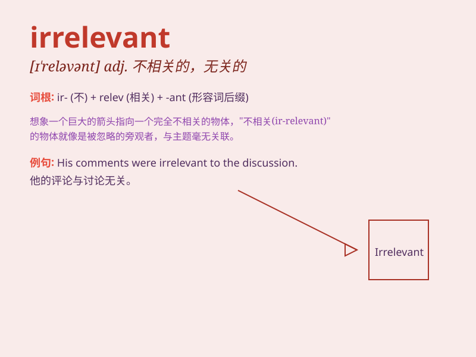

## irrelevant

**英音:** _[ɪ\'relɪv(ə)nt]_ **美音:** _[ɪ\'rɛləvənt]_

**译义:** *adj.不相关的adj.不相关的,不切题的*

### 短语

+ **irrelevant information:** _不相关的信息_

+ **irrelevant answer:** _不相关的回答_

+ **irrelevant topic:** _不相关的话题_

+ **irrelevant evidence:** _不相关的证据_

+ **irrelevant detail:** _不相关的细节_

### 例句

#### 例句1

> **His comments were irrelevant to the discussion at hand.**

**中文翻译:** 他的评论与正在进行的讨论无关。

**单词释义:** 不相关的；无关紧要的

#### 例句2

> **The information she provided was completely irrelevant.**

**中文翻译:** 她提供的信息完全不相关。

**单词释义:** 不相干的；无关的

#### 例句3

> **This question is irrelevant and should be ignored.**

**中文翻译:** 这个问题不相关，应该被忽略。

**单词释义:** 无关紧要的；不合适的

### 背诵小故事

> A man was giving a speech about space exploration. But someone kept
talking about cooking, which was completely irrelevant. The man got
frustrated as the cooking talk had nothing to do with his important
topic of space.

**一个人正在发表关于太空探索的演讲。但有人一直在谈论烹饪，这完全不相关。这个人很沮丧，因为烹饪的谈论与他重要的太空主题毫无关系。**

### 图义

