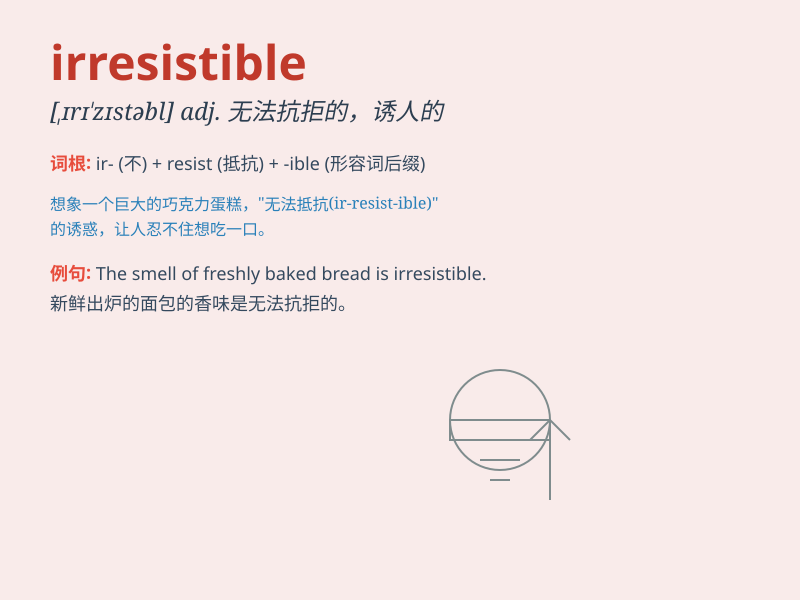

## irresistible

**英音:** _[ɪrɪ\'zɪstɪb(ə)l]_ **美音:**
_[,ɪrɪ\'zɪstəbl]_

**译义:** *adj.不可抵抗的,不能压制的*

### 短语

+ **irresistible charm:** _无法抗拒的魅力_

+ **irresistible force:** _不可抗拒的力量_

+ **irresistible temptation:** _无法抵制的诱惑_

+ **irresistible urge:** _难以抑制的冲动_

+ **irresistible appeal:** _不可抵挡的吸引力_

### 例句

#### 例句1

> **The smell of freshly baked bread was irresistible.**

**中文翻译:** 新鲜出炉的面包的气味令人无法抗拒。

**单词释义:** 无法抗拒的

#### 例句2

> **She had an irresistible charm that drew people to her.**

**中文翻译:** 她有一种让人无法抗拒的魅力，把人们吸引到她身边。

**单词释义:** 无法抗拒的

#### 例句3

> **The offer of a free vacation was irresistible.**

**中文翻译:** 免费度假的提议让人无法拒绝。

**单词释义:** 无法拒绝的

### 背诵小故事

> One day, I saw an irresistible cake in a bakery. Its smell and
appearance were so charming that I couldn\'t resist buying it. The word
\'irresistible\' means too attractive or tempting to be resisted.

**有一天，我在面包店看到一个让人无法抗拒的蛋糕。它的气味和外观太迷人了，以至于我忍不住买了它。'irresistible'这个单词意思是太有吸引力或太诱人以至于无法抗拒。**

### 图义

