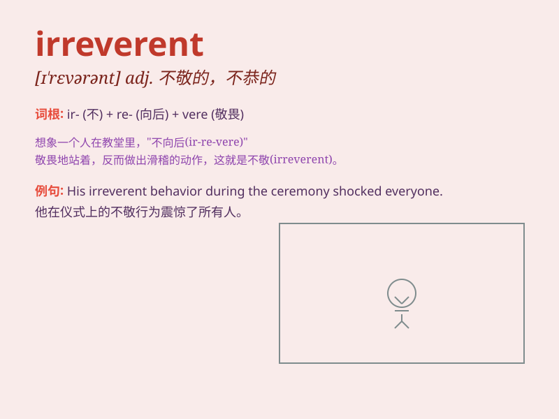

## irreverent

**英音:** _[ɪ\'rev(ə)r(ə)nt]_ **美音:** _[ɪ\'rɛvərənt]_

**译义:** *adj.不尊敬的*

### 短语

+ **irreverent humor:** _不敬的幽默_

+ **irreverent attitude:** _不尊敬的态度_

+ **irreverent remarks:** _无礼的言论_

+ **irreverent behavior:** _不敬的行为_

+ **irreverent style:** _不拘礼节的风格_

### 例句

#### 例句1

> **He has an irreverent sense of humor that sometimes offends
people.**

**中文翻译:** 他有一种有时会冒犯人的玩世不恭的幽默感。

**单词释义:** 玩世不恭的

#### 例句2

> **The irreverent student constantly disrupted the class with his
jokes.**

**中文翻译:** 这个无礼的学生总是用他的笑话扰乱课堂。

**单词释义:** 无礼的；不敬的

#### 例句3

> **Her irreverent remarks about the traditional customs drew
criticism.**

**中文翻译:** 她对传统习俗不敬的言论招致了批评。

**单词释义:** 不敬的；不虔诚的

### 背诵小故事

> A young artist was always irreverent. He didn\'t follow traditional
rules when creating. He made fun of old styles and dared to be
different. This made some people angry but also led to amazing new art.

**一位年轻的艺术家总是无礼的。他在创作时不遵循传统规则。他取笑旧风格，敢于与众不同。这让一些人生气，但也带来了令人惊叹的新艺术。**

### 图义

