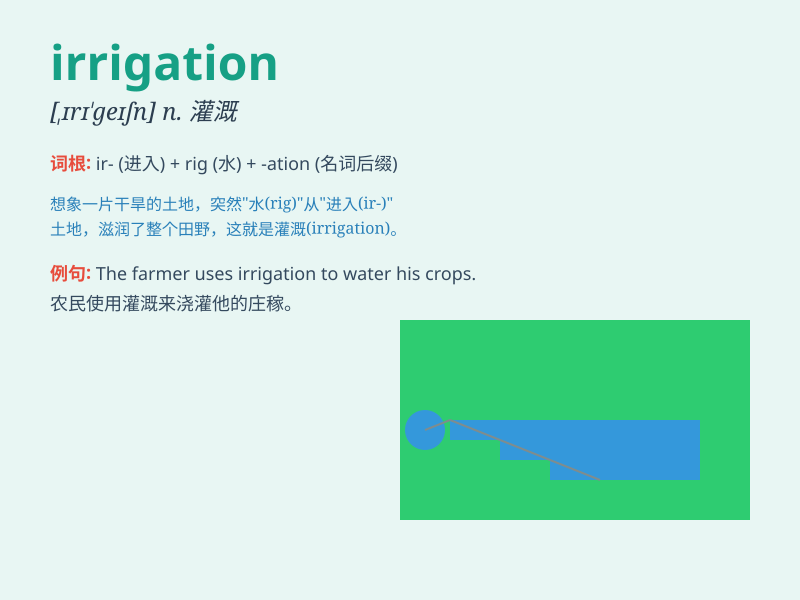

## irrigation

**英音:** _[ˌɪrɪˈgeɪʃən]_ **美音:** _[ˌɪrəˈgeɪʃən]_

**译义:** *n.灌溉,冲洗*

### 短语

+ **irrigation system:** _灌溉系统_

+ **surface irrigation:** _地面灌溉_

+ **drip irrigation:** _滴灌_

+ **irrigation canal:** _灌溉渠道_

+ **sprinkler irrigation:** _喷灌_

### 例句

#### 例句1

> **The irrigation system in this farm is very advanced.**

**中文翻译:** 这个农场的灌溉系统非常先进。

**单词释义:** 灌溉；灌溉系统

#### 例句2

> **Irrigation is essential for the growth of crops in dry areas.**

**中文翻译:** 在干旱地区，灌溉对于农作物的生长至关重要。

**单词释义:** 灌溉

#### 例句3

> **They are working on improving the irrigation methods to save
water.**

**中文翻译:** 他们正在致力于改进灌溉方法以节约用水。

**单词释义:** 灌溉；灌溉方法

### 背诵小故事

> Once upon a time, a farmer was very worried about his dry fields.
Then he found the solution - irrigation. He built canals to bring water
to the fields and made the crops grow happily. With irrigation, the
harvest was bountiful.

**从前，有个农民非常担心他干旱的田地。然后他找到了办法------灌溉。他修建渠道把水引到田里，让庄稼快乐地生长。有了灌溉，收成很丰富。**

### 图义

