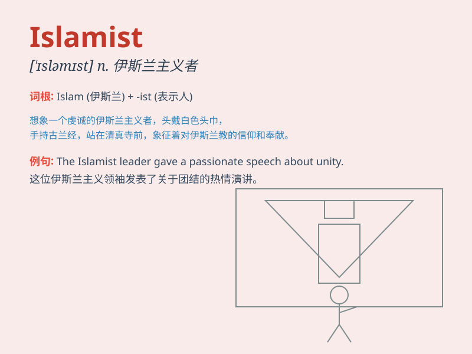

## Islamist

**英音:** _[ˈɪsləmɪst]_ **美音:** _[ˈɪsləmɪst]_

**译义:**
*n.伊斯兰主义者，伊斯兰教信徒；adj.伊斯兰主义的，伊斯兰教的*

### 短语

+ **Islamist movement:** _伊斯兰主义运动_

+ **Islamist group:** _伊斯兰主义团体_

+ **Islamist ideology:** _伊斯兰主义意识形态_

+ **radical Islamist:** _激进的伊斯兰主义者_

+ **Islamist extremism:** _伊斯兰主义极端主义_

### 例句

#### 例句1

> **The Islamist movement has gained significant support in recent
years.**

**中文翻译:** 伊斯兰主义运动近年来获得了大量的支持。

**单词释义:** 伊斯兰主义者；伊斯兰教徒

#### 例句2

> **He was accused of having ties with Islamist groups.**

**中文翻译:** 他被指控与伊斯兰主义团体有联系。

**单词释义:** 伊斯兰主义者；伊斯兰教徒

#### 例句3

> **The government is taking measures to counter the influence of
Islamist extremists.**

**中文翻译:** 政府正在采取措施对抗伊斯兰极端主义者的影响。

**单词释义:** 伊斯兰主义者；伊斯兰教徒

### 背诵小故事

> A young man named Tom was deeply influenced by Islamist ideas. He
traveled to many places to spread these beliefs. But later, he realized
the importance of peace and changed his mind.

**一个叫汤姆的年轻人深受伊斯兰主义者思想的影响。他去了很多地方传播这些信仰。但后来，他意识到和平的重要性并改变了想法。**

### 图义

