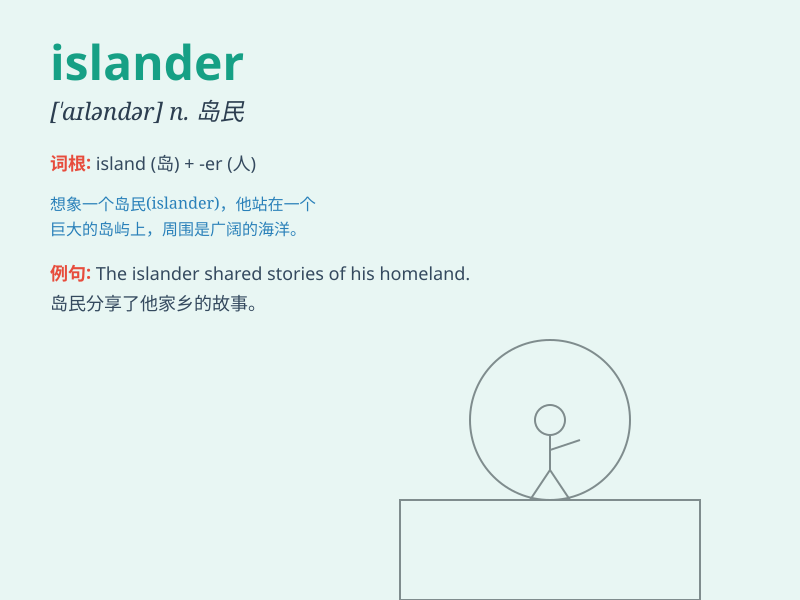

## islander

**英音:** _[\'aɪləndə]_ **美音:** _[\'aɪləndɚ]_

**译义:** *n.岛上居民*

### 短语

+ **native islander:** _当地岛民_

+ **remote islander:** _偏远岛屿的居民_

+ **peaceful islander:** _爱好和平的岛民_

+ **friendly islander:** _友好的岛民_

+ **traditional islander:** _传统的岛民_

### 例句

#### 例句1

> **The islander led a simple life on the small island.**

**中文翻译:** 这位岛民在小岛上过着简单的生活。

**单词释义:** 岛民

#### 例句2

> **The islanders are known for their unique handicrafts.**

**中文翻译:** 这些岛民以他们独特的手工艺品而闻名。

**单词释义:** 岛民

#### 例句3

> **The new policy will have a significant impact on the islanders\'
livelihoods.**

**中文翻译:** 新政策将对岛民的生计产生重大影响。

**单词释义:** 岛民

### 背诵小故事

> Once upon a time, there was a man who lived on an island. People
called him an islander. He knew every corner of the island and loved his
peaceful life there.

**从前，有一个人住在一个岛上。人们称他为岛民。他熟知岛上的每一个角落，并热爱在那里的平静生活。**

### 图义

