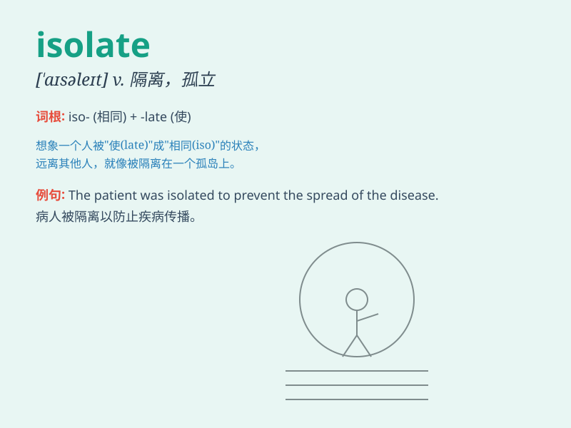

## isolate

**英音:** _[\'aɪsəleɪt]_ **美音:** _[aɪslˌet]_

**译义:** *vt.使隔离,使孤立,使绝缘,离析n.隔离种群*

### 短语

+ **isolate from:** _与\...隔离；使脱离_

+ **isolate oneself:** _自我孤立_

+ **be isolated:** _被孤立；处于孤立状态_

+ **isolated incident:** _孤立事件_

+ **isolated area:** _隔离区；孤立地区_

### 例句

#### 例句1

> **The patient was isolated to prevent the spread of the
infection.**

**中文翻译:** 这位病人被隔离以防止感染的传播。

**单词释义:** 使隔离；使孤立

#### 例句2

> **She felt isolated from her friends when she moved to a new
city.**

**中文翻译:** 当她搬到一个新城市时，她感到与朋友们隔绝了。

**单词释义:** 使隔绝；使脱离

#### 例句3

> **Scientists are trying to isolate the cause of the disease.**

**中文翻译:** 科学家们正试图找出这种疾病的病因。

**单词释义:** 分离；找出

### 背诵小故事

> A brave scientist was on a remote island to study rare animals. To
protect them from outside interference, he had to isolate the area. With
careful planning and hard work, he successfully isolated the animals and
ensured their safety.

**一位勇敢的科学家在一个偏远的岛屿上研究珍稀动物。为了保护它们免受外界干扰，他不得不隔离这个区域。通过精心规划和努力工作，他成功地隔离了这些动物并确保了它们的安全。**

### 图义

