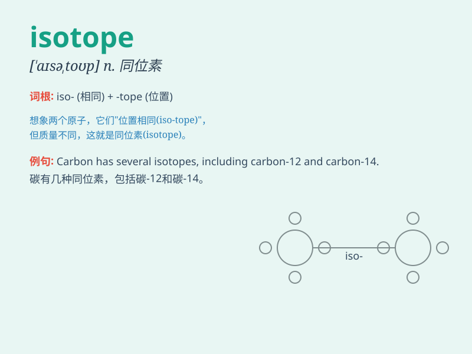

## isotope

**英音:** _[\'aɪsətəʊp]_ **美音:** _[\'aɪsə\'top]_

**译义:** *n.[化]同位素*

### 短语

+ **stable isotope:** _稳定同位素_

+ **radioactive isotope:** _放射性同位素_

+ **isotope effect:** _同位素效应_

+ **isotope separation:** _同位素分离_

+ **isotope tracer:** _同位素示踪剂_

### 例句

#### 例句1

> **Carbon has several isotopes, such as carbon-12 and carbon-14.**

**中文翻译:** 碳有多种同位素，例如碳 12 和碳 14。

**单词释义:** 同位素

#### 例句2

> **The study of isotopes is crucial in many scientific fields.**

**中文翻译:** 同位素研究在许多科学领域至关重要。

**单词释义:** 同位素

#### 例句3

> **Isotopes can be used to determine the age of ancient
artifacts.**

**中文翻译:** 同位素可用于确定古代文物的年龄。

**单词释义:** 同位素

### 背诵小故事

> Imagine a group of scientists in a lab. They are studying special
atoms. These atoms, called isotopes, have the same number of protons but
different numbers of neutrons. Just like twins with a slight difference!

**想象一群科学家在实验室里。他们正在研究特殊的原子。这些原子被称为同位素，具有相同数量的质子，但中子数不同。就像略有差异的双胞胎！**

### 图义

