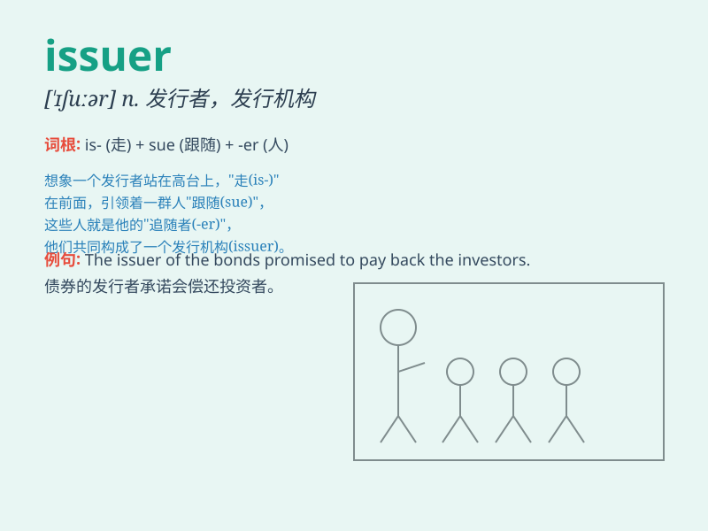

## issuer

**英音:** _[\'ɪʃjuːə]_ **美音:** _[\'ɪsjʊə]_

**译义:** *n.发行者*

### 短语

+ **credit card issuer:** _信用卡发卡机构_

+ **bond issuer:** _债券发行人_

+ **stock issuer:** _股票发行人_

+ **securities issuer:** _证券发行人_

+ **certificate issuer:** _证书颁发者_

### 例句

#### 例句1

> **The issuer of the bond is a well-known financial institution.**

**中文翻译:** 本次债券的发行人为知名金融机构。

**单词释义:** 发行人

#### 例句2

> **The credit card issuer offers various rewards programs.**

**中文翻译:** 信用卡发卡机构提供各种奖励计划。

**单词释义:** 发行人

#### 例句3

> **The issuer of the new currency is the central bank.**

**中文翻译:** 新货币的发行者是中央银行。

**单词释义:** 发行者

### 背诵小故事

> 想象一个银行柜台前，工作人员正在忙碌地处理业务。他就是
issuer，负责发行信用卡、支票等。就像他把这些金融工具'发出'给客户一样，issuer
就是发出者、发行人。

**这个故事描述了 issuer
作为发出者、发行人的含义，帮助记忆这个单词。**

### 图义

