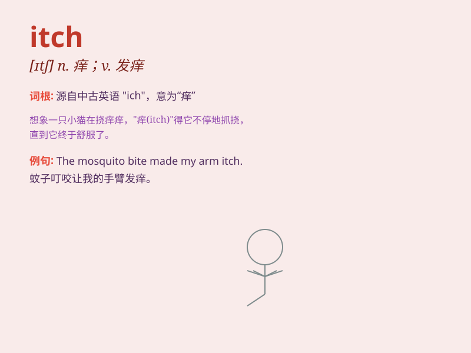

## itch

**英音:** _[ɪtʃ]_ **美音:** _[ɪtʃ]_

**译义:** *n.发痒,渴望,[医]疥疮(尤指发痒的)vi.发痒,渴望*

### 短语

+ **itch for:** _渴望，热望_

+ **have an itch to do sth:** _渴望做某事_

+ **itchy feet:** _漫游癖；旅行癖_

+ **scratch an itch:** _止痒；解决迫切的需求_

+ **the seven-year itch:** _（婚姻中的）七年之痒_

### 例句

#### 例句1

> **I have an itch on my back that I can\'t reach.**

**中文翻译:** 我的背上有一个我够不到的痒。

**单词释义:** 痒

#### 例句2

> **The wool sweater made me itch all over.**

**中文翻译:** 那件羊毛衫让我全身发痒。

**单词释义:** 发痒

#### 例句3

> **He has an itch to travel abroad.**

**中文翻译:** 他渴望出国旅行。

**单词释义:** 渴望；急切的愿望

### 背诵小故事

> One day, a little monkey had an itch on its back. It tried to scratch
but couldn\'t reach. So it asked its friends for help. Finally, a bird
helped it scratch the itchy spot. Poor monkey, that annoying itch!

**有一天，一只小猴子背上痒。它试着去挠但够不着。于是它向朋友们求助。最后，一只鸟帮它挠了痒的地方。可怜的猴子，那恼人的痒！**

### 图义

