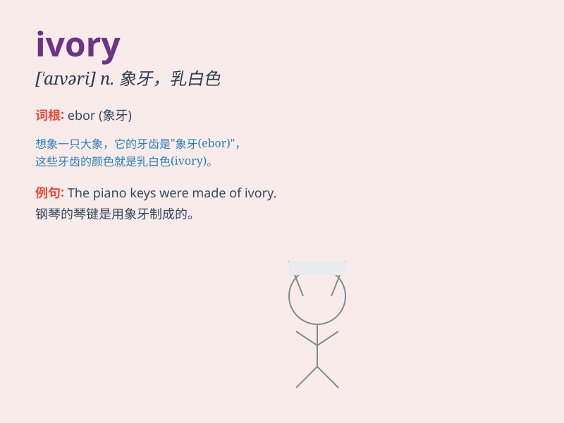

## ivory

**英音:** _[\'aɪv(ə)rɪ]_ **美音:** _[\'aɪvəri]_

**译义:** *n.象牙*

### 短语

+ **ivory tower:** _象牙塔（指脱离实际生活的小天地）_

+ **ivory trade:** _象牙贸易_

+ **ivory white:** _象牙白_

+ **ivory carving:** _象牙雕刻_

+ **ivory skin:** _象牙色的皮肤_

### 例句

#### 例句1

> **The piano keys were made of ivory.**

**中文翻译:** 钢琴琴键是用象牙制成的。

**单词释义:** 象牙

#### 例句2

> **She wore an ivory necklace that enhanced her beauty.**

**中文翻译:** 她戴着一条象牙项链，增添了她的美丽。

**单词释义:** 象牙制成的物品

#### 例句3

> **The artist painted the landscape in tones of ivory and beige.**

**中文翻译:** 艺术家用象牙色和米色的色调描绘了风景。

**单词释义:** 象牙色

### 背诵小故事

> A long time ago, a brave adventurer was on a journey. In a hidden
cave, he found a shiny object. It was a beautiful piece of ivory. He
knew it was precious and rare, and this discovery made his adventure
unforgettable.

**很久以前，一位勇敢的冒险家在旅途中。在一个隐蔽的洞穴里，他发现了一个闪闪发光的东西。那是一块美丽的象牙。他知道它珍贵又稀有，这次发现让他的冒险难以忘怀。**

### 图义

