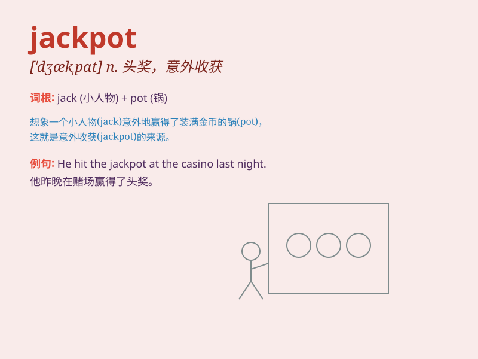

## jackpot

**英音:** _[\'dʒækpɒt]_ **美音:** _[\'dʒækpɑt]_

**译义:** *n.[桥牌] 累积赌注,累积奖金*

### 短语

+ **hit the jackpot:** _获得巨大成功；赢得巨额奖金_

+ **jackpot winner:** _头奖获得者_

+ **mega jackpot:** _超级大奖_

+ **jackpot prize:** _头奖；大奖_

+ **jackpot machine:** _吃角子老虎机_

### 例句

#### 例句1

> **He hit the jackpot and won a million dollars in the lottery.**

**中文翻译:** 他中了大奖，赢得了一百万美元的彩票。

**单词释义:** 头奖；累积奖金；十分成功的事

#### 例句2

> **Finding that rare antique was like hitting the jackpot for the
collector.**

**中文翻译:** 对于收藏家来说，找到那件稀有的古董就像中了大奖。

**单词释义:** 巨大成功；巨大收获

#### 例句3

> **The new game show offers a huge jackpot to the winner.**

**中文翻译:** 新的游戏节目为获胜者提供了巨额奖金。

**单词释义:** 巨额奖金

### 背诵小故事

> One day, Jack was in a casino. He put a coin in a slot machine and
won the biggest prize - the jackpot. Everyone was amazed. From then on,
whenever Jack thought of that moment, he remembered the word
\'jackpot\'.

**有一天，杰克在赌场。他往老虎机里投了一枚硬币，然后赢得了最大的奖------头奖。每个人都很惊讶。从那以后，每当杰克想到那个时刻，他就记住了'jackpot'这个词。**

### 图义

