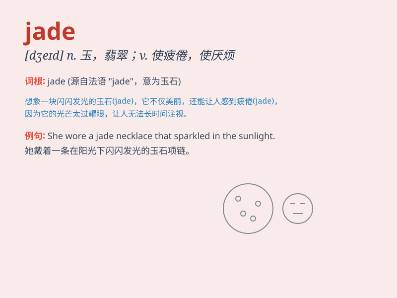

## jade

**英音:** _[dʒeɪd]_ **美音:** _[dʒed]_

**译义:** *n.碧玉,翡翠,老马adj.绿色的,玉制的v.(使)疲倦*

### 短语

+ **jade green:** _翠绿色；绿玉色_

+ **white jade:** _白玉_

+ **jade carving:** _玉雕_

+ **jade bracelet:** _玉手镯_

+ **jade stone:** _玉石_

### 例句

#### 例句1

> **She wore a beautiful jade bracelet.**

**中文翻译:** 她戴着一只漂亮的玉手镯。

**单词释义:** 玉；翡翠

#### 例句2

> **The horse was as fleet as a jade-green wind.**

**中文翻译:** 这匹马快如一阵碧绿的风。

**单词释义:** 绿色

#### 例句3

> **He has the heart of a jade.**

**中文翻译:** 他有一颗纯洁的心。

**单词释义:** 纯洁；无暇

### 背诵小故事

> A girl named Jade was lost in a forest. She wore a green dress like
the color of jade. When people found her, they said, \'Look, it\'s Jade,
as precious as jade.\'

**一个叫 Jade
的女孩在森林里迷路了。她穿着一件像翡翠颜色的绿色裙子。当人们找到她时，他们说：'看，是
Jade，像翡翠一样珍贵。'**

### 图义

