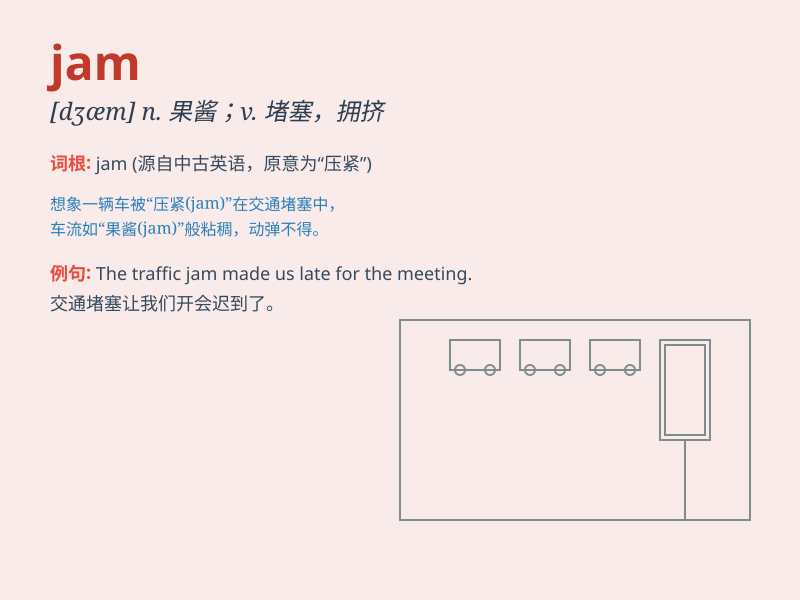

## jam

**英音:** _[dʒæm]_ **美音:** _[dʒæm]_

**译义:**
*n.果酱,拥挤,堵塞,困境vt.挤进,使塞满,混杂,压碎,使堵塞vi.堵塞,轧住,拥挤*

### 短语

+ **traffic jam:** _交通堵塞_

+ **jam session:** _即兴演奏会_

+ **be in a jam:** _陷入困境_

+ **jam-packed:** _拥挤不堪的_

+ **jam tomorrow:** _许而不予的好东西；可望而不可及的东西_

### 例句

#### 例句1

> **The traffic jam made me late for work.**

**中文翻译:** 交通堵塞使我上班迟到了。

**单词释义:** 堵塞

#### 例句2

> **She spread jam on the toast.**

**中文翻译:** 她把果酱涂在吐司上。

**单词释义:** 果酱

#### 例句3

> **The gears jammed and the machine stopped working.**

**中文翻译:** 齿轮卡住了，机器停止了运转。

**单词释义:** 卡住

### 背诵小故事

> One day, I was on my way home and got stuck in a traffic jam. Cars
were everywhere and couldn\'t move. It was a total chaos. I realized
\'jam\' means a crowded and blocked situation.

**有一天，我在回家的路上遭遇了交通堵塞。到处都是车，无法移动。一片混乱。我意识到\'jam\'就是指拥挤堵塞的状况。**

### 图义

